## Summary

Ad click aggregation is used for billing, so data accuracy is critical. **Exactly-once processing** ensures every event is counted once -- no more, no less. Duplicates can originate from client retries or server crashes before Kafka offset commits. The solution uses **distributed transactions** that atomically send aggregated results downstream, save the offset to external storage, and acknowledge upstream Kafka, preventing both data loss and duplication.

## How It Works

```mermaid
graph TB
    subgraph Problem["Duplication Problem"]
        P1["Aggregator polls events 100-110"]
        P2["Sends result downstream"]
        P3["Crashes before saving offset"]
        P4["New aggregator replays from 100"]
        P5["Events 100-110 counted twice"]
    end

    subgraph Solution["Distributed Transaction Solution"]
        S1["1. Poll events from upstream Kafka"]
        S2["2. Verify offset matches external storage"]
        S3["3. Aggregate events 100-110"]
        S4["4. ATOMIC: Send result + Save offset + ACK upstream"]
    end

    P1 --> P2 --> P3 --> P4 --> P5

    S1 --> S2 --> S3 --> S4
```

1. Aggregator **polls events** from upstream Kafka (e.g., offset 100 to 110)
2. Before processing, **verifies the offset** against external storage (HDFS/S3) to skip already-processed events
3. Aggregates events in memory
4. Executes a **distributed transaction** covering three operations atomically:
   - Send aggregated result to downstream Kafka
   - Save new offset (110) to external storage
   - Acknowledge upstream Kafka with the new offset
5. If any step fails, the entire transaction rolls back -- no partial state
6. On Aggregator failure, a new node reads the last saved offset and replays only from there

## When to Use

- Financial or billing systems where double-counting means money discrepancies
- Any system where event replay after failure must not produce duplicate results
- When at-least-once is not good enough (a few percent duplication could mean millions of dollars)

## Trade-offs

| Aspect | Benefit | Cost |
|---|---|---|
| Exactly-once semantics | Perfect accuracy for billing | Complex distributed transaction logic |
| At-least-once | Simpler implementation | Acceptable only if small duplicates are OK |
| At-most-once | Simplest (fire-and-forget) | Data loss is possible |
| External offset storage (HDFS/S3) | Durable offset tracking | Extra I/O per aggregation batch |
| Kafka-only offset management | Simpler ops | Cannot guarantee exactly-once end-to-end |

## Real-World Examples

- **Apache Flink**: built-in exactly-once via checkpointing and two-phase commit sinks
- **Kafka Transactions**: enable exactly-once semantics with `isolation.level=read_committed`
- **Uber Ad Aggregation**: uses Flink + Kafka + Pinot for exactly-once ad event processing
- **Yelp Ad Aggregation**: end-to-end exactly-once with Apache Flink

## Common Pitfalls

- Saving the offset before sending the result downstream (causes data loss if the send fails)
- Sending the result before saving the offset (causes duplication if the save fails)
- Not using distributed transactions (any non-atomic combination of send/save/ack has a failure window)
- Assuming Kafka's consumer offset commit alone provides exactly-once (it only provides at-least-once without transactional sinks)

## See Also

- [[stream-processing-pipeline]] -- the Kafka queues where exactly-once must be enforced
- [[event-time-vs-processing-time]] -- late events that complicate deduplication
- [[hotspot-mitigation]] -- fault tolerance mechanisms that interact with offset management
