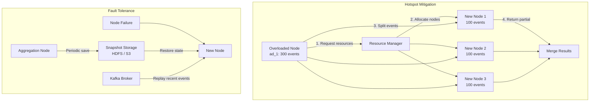

## Summary

Ad click events follow a power-law distribution: a small number of popular ads receive a disproportionate share of clicks, creating **hotspots** where individual aggregation nodes are overwhelmed. The solution involves a **resource manager** that detects overloaded nodes and dynamically allocates extra nodes to split the workload. For **fault tolerance**, aggregation nodes periodically save **snapshots** of their in-memory state (offsets, counters, heaps) to external storage. Failed nodes recover from the latest snapshot and replay only recent events from Kafka. **End-of-day reconciliation** via batch jobs provides a final accuracy check.

## How It Works

1. **Hotspot detection**: if a node receives events beyond its capacity, it contacts the resource manager
2. The resource manager **allocates extra aggregation nodes** to handle the excess
3. The overloaded node **splits events** into groups, each handled by one sub-node
4. Sub-node results are **merged back** to produce the final aggregate
5. **Snapshots** store the Kafka offset plus all in-memory state (counts, top-N heaps)
6. On failure, a new node **restores from the latest snapshot** and replays only events after that point
7. **Reconciliation** runs batch jobs at end-of-day to compare with real-time results

## When to Use

- Any system with skewed key distributions (popular items, viral content, celebrity accounts)
- When in-memory state is expensive to rebuild from scratch (would require full Kafka replay)
- When billing accuracy requires a final correctness check beyond real-time processing

## Trade-offs

| Aspect | Benefit | Cost |
|---|---|---|
| Dynamic node allocation | Handles hotspots automatically | Resource manager adds complexity |
| Fixed partitioning | Simple, no resource manager needed | Cannot handle skewed distributions |
| Frequent snapshots (every 30s) | Fast recovery, little replay | More I/O overhead |
| Infrequent snapshots (every 10 min) | Less I/O | Longer recovery, more replay |
| End-of-day reconciliation | Catches all errors | Results only corrected next day |
| Hourly reconciliation | Faster correction | Higher compute cost |
| Global-Local aggregation | Advanced hotspot handling | More complex implementation |

## Real-World Examples

- **Apache Flink**: checkpointing mechanism for exactly-once fault tolerance with incremental snapshots
- **Apache Spark**: RDD lineage for fault recovery (recompute from source)
- **Google Dataflow**: automatic work rebalancing (liquid sharding) for hotspot mitigation
- **Flink performance tuning**: Global-Local and Split Distinct aggregation for skewed keys

## Common Pitfalls

- Not monitoring for hotspots until an aggregation node runs out of memory
- Saving snapshots to local disk (lost when the node dies) instead of external storage (HDFS/S3)
- Replaying the entire Kafka log instead of from the last snapshot (can take hours)
- Assuming reconciliation will catch all errors -- it only runs periodically and cannot fix billing in real-time

## See Also

- [[mapreduce-aggregation]] -- the DAG nodes that need hotspot mitigation
- [[stream-processing-pipeline]] -- the Kafka infrastructure where replays happen
- [[exactly-once-processing]] -- offset management that interacts with snapshot recovery
