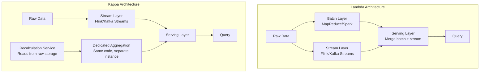

## Summary

Systems processing both real-time and historical data must choose between **Lambda** and **Kappa** architectures. Lambda runs **batch and stream paths in parallel** -- the batch layer corrects the stream layer's approximations. Kappa **unifies both into a single stream processing engine**, using the same code for real-time aggregation and historical replay. The ad click system uses Kappa: a recalculation service reads raw data and feeds it through a dedicated aggregation service instance.

## How It Works

1. **Lambda**: raw data splits into a batch path (complete but slow) and a stream path (fast but approximate)
   - The serving layer merges results from both paths
   - Two codebases must be maintained and kept in sync
2. **Kappa**: only a stream path exists
   - For historical replay, a recalculation service reads raw data from storage
   - Replay data is processed by a **dedicated aggregation instance** (same code, separate from live)
   - Results are written to the same aggregation database
3. In the ad click system, Kappa is chosen for simplicity -- one codebase, one processing paradigm

## When to Use

| Architecture | Best For |
|---|---|
| **Lambda** | When batch accuracy is non-negotiable and you can afford two codebases |
| **Kappa** | When stream processing is accurate enough and you want operational simplicity |
| **Kappa with reconciliation** | Best of both worlds: stream for real-time, batch reconciliation for correction |

## Trade-offs

| Aspect | Benefit | Cost |
|---|---|---|
| Lambda (dual path) | Batch corrects stream inaccuracies | Two codebases, higher maintenance |
| Kappa (single path) | One codebase, simpler operations | Replay depends on event retention |
| Recalculation service | Reuses stream code for historical replay | Requires raw data storage and separate compute |
| Batch reconciliation | Catches all inaccuracies | Only runs periodically (end-of-day) |
| Stream-only (no reconciliation) | Lowest complexity | No safety net for stream errors |

## Real-World Examples

- **LinkedIn**: pioneered Kappa architecture (Jay Kreps coined the term)
- **Uber**: uses Kappa with Apache Flink for real-time ad aggregation
- **Netflix**: uses Lambda for recommendation pipelines (batch + real-time)
- **Twitter**: hybrid approach combining batch (Scalding) and stream (Heron) processing

## Common Pitfalls

- Choosing Lambda when the team cannot maintain two codebases (leads to divergence and bugs)
- Choosing Kappa without ensuring sufficient Kafka retention for replay needs
- Not providing a separate aggregation instance for replay (replay competes with live processing)
- Skipping end-of-day reconciliation when using Kappa (no safety net for stream processing bugs)

## See Also

- [[stream-processing-pipeline]] -- the Kafka infrastructure that both architectures build on
- [[exactly-once-processing]] -- accuracy guarantees that reduce the need for batch correction
- [[mapreduce-aggregation]] -- the DAG processing model used in both paths
