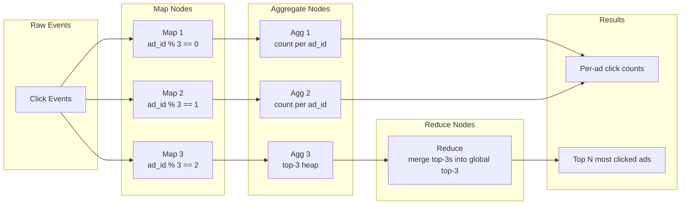

## Summary

The ad click aggregation service uses a **directed acyclic graph (DAG)** of Map, Aggregate, and Reduce nodes to parallelize computation. Map nodes partition events by ad_id, Aggregate nodes count clicks per ad_id in memory every minute, and Reduce nodes merge partial top-N results into the final output. This is the MapReduce paradigm applied to streaming data, turning billions of raw events into compact aggregated metrics.

## How It Works

1. **Map nodes** read events from Kafka, optionally clean/normalize, and route by `ad_id % N`
2. **Aggregate nodes** maintain in-memory counters (click count) and heap structures (top-N) per minute
3. **Reduce nodes** combine partial results (e.g., merge 3 top-3 lists into a global top-3)
4. Nodes communicate via **TCP** (cross-process) or **shared memory** (cross-thread)
5. The DAG is horizontally scalable by adding more Map and Aggregate nodes

## When to Use

- Counting or ranking events partitioned by a key (ad_id, user_id, etc.)
- When data volume is too large for a single machine to aggregate
- Real-time or near-real-time aggregation where results must be produced every minute
- Top-N queries that can be decomposed into partial top-N merges

## Trade-offs

| Aspect | Benefit | Cost |
|---|---|---|
| DAG of small nodes | Clear separation of concerns, easy to test | More complex orchestration |
| In-memory aggregation | Very fast, sub-second per batch | Data lost if node crashes (need snapshots) |
| Partition by ad_id | Deterministic routing, single-node aggregation | Hotspots for popular ads |
| Multi-threaded nodes | Higher throughput per machine | Thread contention, harder debugging |
| Resource-provider deployment (YARN) | Auto-scaling, multi-processing | Dependency on Hadoop ecosystem |

## Real-World Examples

- **Apache Flink**: production-grade stream processing with exactly-once DAG execution
- **Apache Spark Streaming**: micro-batch MapReduce for near-real-time aggregation
- **Google Dataflow**: managed stream/batch processing with DAG model
- **Facebook real-time aggregation**: custom MapReduce pipelines for ad metrics

## Common Pitfalls

- Skipping the Map node and subscribing Aggregate nodes directly to Kafka (loses the ability to clean/normalize data and rebalance partitions)
- Not using heap data structures for top-N queries (sorting the entire dataset is much slower)
- Forgetting that map-aggregate-reduce is really map-reduce-reduce in MapReduce terminology
- Undersizing the number of Aggregate nodes, causing memory pressure during peak traffic

## See Also

- [[stream-processing-pipeline]] -- the Kafka infrastructure feeding events to the DAG
- [[hotspot-mitigation]] -- handling popular ads that overload individual aggregate nodes
- [[aggregation-windows]] -- tumbling and sliding windows that define when aggregation produces results
