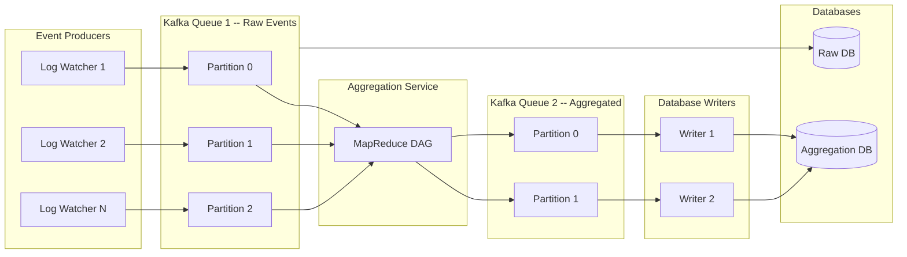

## Summary

A **stream processing pipeline** for ad click aggregation decouples data producers from consumers using Kafka message queues. Log watchers on application servers produce raw click events into a first Kafka queue. An aggregation service consumes these events, computes per-minute counts and top-N ads, and writes aggregated results to a second Kafka queue. Database writers then persist results to the aggregation database. This asynchronous architecture lets each component scale independently and absorbs traffic spikes without back-pressure failures.

## How It Works

1. **Log watchers** tail click event logs on application servers and produce events to Kafka
2. Events are **partitioned by ad_id** so all events for the same ad land in the same partition
3. The **aggregation service** consumes events and computes results in memory each minute
4. Aggregated results are written to a **second Kafka queue** to achieve exactly-once semantics
5. **Database writers** poll the second queue and persist to Cassandra
6. A **query service** (dashboard) reads from the aggregation database

## When to Use

- High-volume event streams where producers and consumers operate at different rates
- When end-to-end latency of a few minutes is acceptable (not sub-second)
- Systems requiring exactly-once delivery semantics for billing or financial data
- When you need independent scaling of ingestion, processing, and storage layers

## Trade-offs

| Aspect | Benefit | Cost |
|---|---|---|
| Two Kafka queues | Exactly-once semantics, decoupled stages | More infrastructure to manage |
| Single queue (skip second) | Simpler architecture | Cannot guarantee exactly-once end-to-end |
| Synchronous processing | Lower latency | Cannot handle traffic spikes; cascading failures |
| Async via Kafka | Absorbs spikes, independent scaling | Added latency (seconds to minutes) |
| Partitioning by ad_id | All events for one ad in one partition | Hot partitions for popular ads |

## Real-World Examples

- **Facebook/Meta**: processes billions of ad click events daily through Kafka-based pipelines
- **Google Ads**: real-time click aggregation for billing and campaign management
- **Uber Ad Events**: uses Apache Flink + Kafka + Pinot for exactly-once ad aggregation
- **Yelp**: implements exactly-once ad click aggregation with Apache Flink

## Common Pitfalls

- Not pre-allocating enough Kafka partitions (changing partition count remaps ad_ids, causing data shuffling)
- Performing consumer rebalancing during peak hours (can take minutes, causing lag)
- Ignoring the second message queue and writing directly to DB (breaks exactly-once guarantee)
- Not monitoring consumer lag -- if the queue grows, aggregation nodes may need scaling

## See Also

- [[mapreduce-aggregation]] -- the DAG of nodes that processes events from this pipeline
- [[exactly-once-processing]] -- how distributed transactions ensure no data loss or duplication
- [[lambda-kappa-architecture]] -- how the pipeline handles both real-time and historical replay
