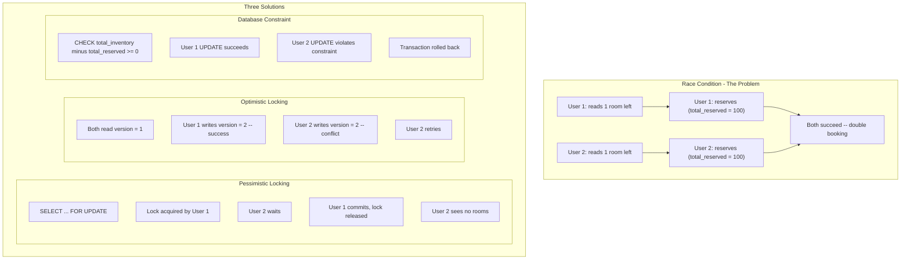

## Summary

When multiple users attempt to book the last available room simultaneously, the system must prevent **double-booking**. Three approaches are compared: **pessimistic locking** (`SELECT ... FOR UPDATE`) serializes transactions but risks deadlocks and poor scalability; **optimistic locking** (version column) avoids locks but causes retry storms under high contention; **database constraints** (`CHECK total_inventory - total_reserved >= 0`) are the simplest approach and work well for hotel reservation systems where QPS is moderate.

## How It Works

1. **Pessimistic locking**: `SELECT ... FOR UPDATE` locks the row; other transactions block until release
2. **Optimistic locking**: read the row with its version number; on write, check that version matches; if not, retry
3. **Database constraint**: a CHECK constraint rejects any UPDATE that would make `total_inventory - total_reserved < 0`
4. All three guarantee correctness, but differ in performance and complexity characteristics

## When to Use

| Approach | Best For |
|---|---|
| Pessimistic locking | Extremely high contention (rare in hotel systems) |
| Optimistic locking | Low-to-moderate contention, general-purpose systems |
| Database constraints | Simple systems with moderate QPS (hotel reservations) |

## Trade-offs

| Aspect | Benefit | Cost |
|---|---|---|
| Pessimistic locking | Prevents all conflicts | Deadlock risk; blocks concurrent access; not scalable |
| Optimistic locking | No locks; fast when contention is low | Retry storms when many users compete for same resource |
| Database constraints | Simplest to implement; DB enforces correctness | Not portable across all databases; hard to version-control |
| No concurrency control | Maximum throughput | Double-booking, data corruption |
| Serializable isolation | Strongest guarantee | Severe performance penalty |

## Real-World Examples

- **Hotel reservation systems**: typically use optimistic locking or DB constraints due to low QPS
- **Airline seat selection**: pessimistic locking for individual seat maps (high contention on popular flights)
- **E-commerce flash sales**: optimistic locking with retries or Redis-based distributed locks
- **Banking transfers**: pessimistic locking or serializable transactions for financial integrity

## Common Pitfalls

- Using pessimistic locking for hotel reservations (overkill -- QPS is ~3, not 30,000)
- Not setting lock timeouts with pessimistic locking (can cause indefinite blocking)
- Optimistic locking without a retry limit (infinite retry loops under high contention)
- Assuming database constraints are supported by all databases (some NoSQL databases lack CHECK constraints)

## See Also

- [[reservation-data-model]] -- the inventory table that these locking strategies protect
- [[idempotent-reservation-api]] -- preventing duplicate inserts from the same user
- [[database-sharding-and-caching]] -- how sharding affects locking scope
