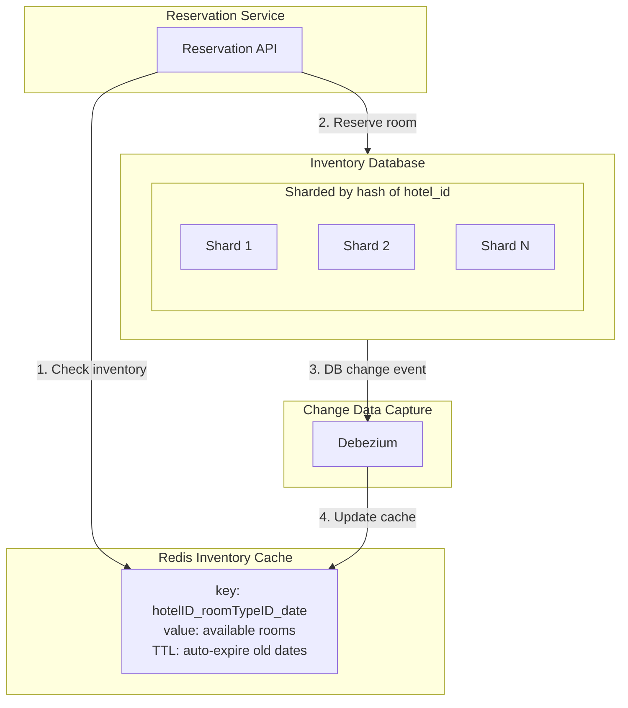

## Summary

For high-traffic booking platforms (booking.com scale, ~30K QPS), the hotel reservation database is **sharded by hash(hotel_id)** across multiple MySQL instances. A **Redis cache** with TTL stores inventory data (key: `hotelID_roomTypeID_date`, value: available rooms), reducing read load by an order of magnitude. Cache updates propagate from the database via **Change Data Capture (CDC)** using tools like Debezium. Critically, the **database always performs the final validation** -- cache staleness affects only UX (user sees availability that is already gone), never correctness.

## How It Works

1. **Read path**: Reservation Service queries Redis cache for available rooms (fast, most requests stop here)
2. **Write path**: reservation writes go to the database first (source of truth)
3. **CDC propagation**: Debezium captures DB changes and updates Redis asynchronously
4. **Final validation**: even if cache says rooms are available, the database does a final check before committing
5. **Sharding**: `hash(hotel_id) % num_shards` distributes data evenly; each shard handles ~1,875 QPS for 16 shards at 30K total
6. **TTL**: Redis auto-expires past dates, keeping only current and future inventory in memory

## When to Use

- When read volume is orders of magnitude higher than writes (hotel detail pages vs actual bookings)
- When database becomes a bottleneck and most read queries can tolerate slightly stale data
- When data has a natural expiration pattern (past dates are irrelevant for booking)

## Trade-offs

| Aspect | Benefit | Cost |
|---|---|---|
| Redis cache for inventory | 10x+ read throughput improvement | Cache-DB consistency gap |
| No cache | Always consistent, simpler | DB becomes bottleneck at scale |
| CDC via Debezium | Automatic, near-real-time cache updates | Additional infrastructure |
| Application-level cache update | No CDC dependency | Risk of missed updates on edge cases |
| Sharding by hotel_id | Natural for hotel queries | Cross-shard queries are expensive |
| Sharding by user_id | Good for user history queries | Hotel queries span all shards |

## Real-World Examples

- **Booking.com**: sharded databases with aggressive caching for inventory
- **Expedia**: Redis caching for availability and pricing data
- **Airbnb**: sharded databases with application-level caching
- **Debezium**: open-source CDC platform used by companies like Zalando and Wepay

## Common Pitfalls

- Trusting the cache as the source of truth (cache says available, but DB says sold out -- must check DB)
- Not implementing TTL on cache entries (stale data for past dates wastes memory)
- Sharding by a key other than hotel_id (most queries filter by hotel first)
- Forgetting to handle the CDC lag window (brief period where cache and DB disagree)

## See Also

- [[reservation-data-model]] -- the inventory table being cached and sharded
- [[concurrency-control]] -- how locking works within a single shard
- [[hotel-microservice-architecture]] -- the service that owns the reservation and inventory data
