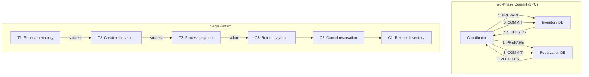

## Summary

In a pure microservice architecture where each service owns its database, a single logical operation (reserve a room and update inventory) spans multiple databases. **Two-phase commit (2PC)** guarantees atomicity but is a blocking protocol -- one slow node stalls everything. The **Saga pattern** decomposes the operation into a sequence of local transactions with **compensating rollbacks** on failure, relying on eventual consistency. Both add significant complexity, which is why the chapter recommends the pragmatic approach of co-locating reservation and inventory in the same database.

## How It Works

### Two-Phase Commit (2PC)
1. **Phase 1 (Prepare)**: Coordinator asks all participants to prepare (acquire locks, validate)
2. **Phase 2 (Commit)**: if all vote YES, coordinator sends COMMIT; if any votes NO, sends ABORT
3. **Problem**: if the coordinator or any participant fails during Phase 2, all participants block

### Saga Pattern
1. Each step is a **local transaction** that publishes an event or message to trigger the next step
2. If step N fails, **compensating transactions** (C_N, C_{N-1}, ..., C_1) undo all previous steps
3. The saga provides **eventual consistency** -- intermediate states are visible to other transactions
4. Two coordination approaches: **choreography** (events) and **orchestration** (central controller)

## When to Use

| Approach | Best For |
|---|---|
| **Co-located DB** (recommended) | When services naturally share data and ACID is important |
| **2PC** | When atomicity is non-negotiable and latency tolerance exists |
| **Saga** | When services must be fully independent and eventual consistency is acceptable |

## Trade-offs

| Aspect | Benefit | Cost |
|---|---|---|
| Co-located DB | Single ACID transaction, simple code | Less microservice independence |
| 2PC | Atomic across databases | Blocking; slow node stalls everything; poor availability |
| Saga (choreography) | Decoupled services, no central coordinator | Hard to trace, complex failure handling |
| Saga (orchestration) | Clear workflow, easier debugging | Central orchestrator is a bottleneck/SPoF |
| Eventual consistency | High availability, independent scaling | Intermediate inconsistent states are visible |
| Strong consistency | Always correct view | Lower availability, higher latency |

## Real-World Examples

- **Amazon**: uses Saga pattern extensively in its microservice ecosystem
- **Uber**: orchestrated sagas for ride booking (matching, payment, notification)
- **Netflix**: choreographed sagas for content delivery pipelines
- **Google Spanner**: 2PC with TrueTime for globally consistent transactions (custom hardware)

## Common Pitfalls

- Choosing 2PC for internet-facing systems (blocking protocol is too slow for user-facing requests)
- Implementing Saga without compensating transactions (partial failures leave data inconsistent)
- Not making compensating transactions idempotent (retries can cause further inconsistencies)
- Splitting reservation and inventory into separate services when a co-located database would be simpler and safer

## See Also

- [[hotel-microservice-architecture]] -- the service design where distributed transaction needs arise
- [[concurrency-control]] -- local locking within a single database
- [[reservation-data-model]] -- the inventory data that both approaches protect
