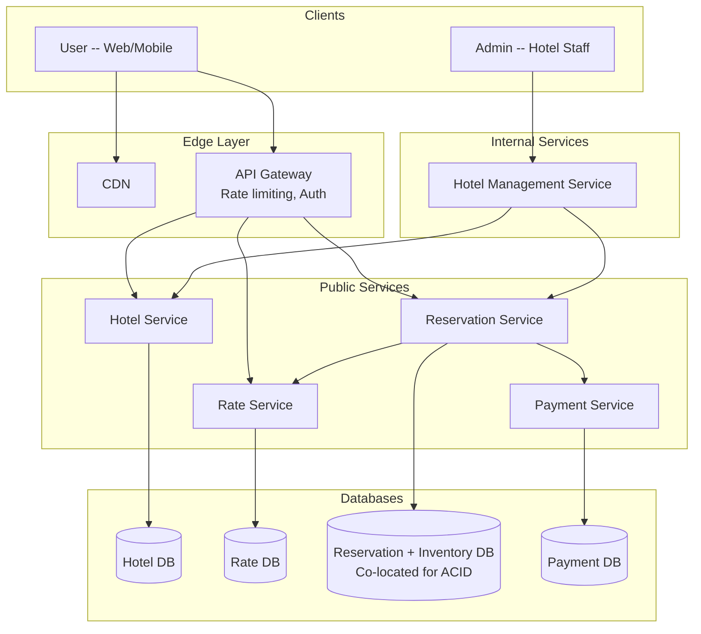

## Summary

The hotel reservation system uses a **microservice architecture** with dedicated services for Hotel, Rate, Reservation, Payment, and Hotel Management. A **public API gateway** provides rate limiting and authentication, while a **CDN** caches static assets. The pragmatic design choice is to **co-locate reservation and inventory tables** in the same relational database, leveraging single-database ACID guarantees instead of complex distributed transactions across microservices.

## How It Works

1. **CDN** caches static content (hotel images, CSS, JS) for fast page loads
2. **API Gateway** handles rate limiting, authentication, and routes requests to services
3. **Hotel Service** serves hotel/room detail pages (cacheable, read-heavy)
4. **Rate Service** provides room prices (dynamic, varies by date and occupancy)
5. **Reservation Service** handles booking logic and inventory management
6. **Payment Service** processes payments and updates reservation status
7. **Hotel Management Service** (internal only) provides admin capabilities
8. Inter-service communication uses gRPC for low latency

## When to Use

- Medium-to-large systems where independent scaling and deployment of services is valuable
- When different services have different scaling profiles (hotel reads >> reservation writes)
- When multiple teams own different parts of the system

## Trade-offs

| Aspect | Benefit | Cost |
|---|---|---|
| Microservices | Independent scaling, separate deployments | Service discovery, network overhead |
| Co-located reservation + inventory DB | ACID transactions, simple concurrency | Less microservice purity |
| Separate DBs per service (pure) | Full independence | Distributed transactions needed (2PC/Saga) |
| CDN for static assets | Reduced server load, faster page loads | Cache invalidation complexity |
| API Gateway | Centralized rate limiting, auth | Single point of failure if not redundant |
| gRPC for inter-service | High performance, strong typing | More complex than REST for simple calls |

## Real-World Examples

- **Booking.com**: microservice architecture with hundreds of services
- **Airbnb**: evolved from monolith to microservices for listing, booking, and payment
- **Marriott**: service-oriented architecture for reservation and loyalty systems
- **Expedia**: microservices for search, booking, and pricing

## Common Pitfalls

- Splitting reservation and inventory into separate microservices without a distributed transaction strategy (leads to double-booking)
- Not using a CDN for hotel images (hotels have many high-resolution photos)
- Ignoring the rate-limiting role of the API gateway (flash sales or events can overwhelm services)
- Over-decomposing into too many microservices for a team that cannot maintain them all

## See Also

- [[reservation-data-model]] -- the database schema that the Reservation Service manages
- [[database-sharding-and-caching]] -- scaling the data layer at booking.com scale
- [[distributed-transactions-saga]] -- what happens if you split reservation and inventory into separate services
