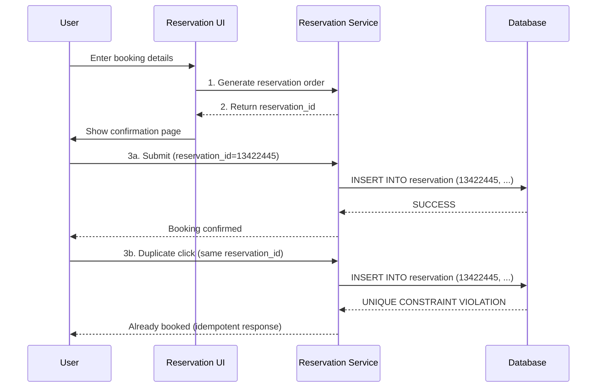

## Summary

An **idempotent API** produces the same result regardless of how many times it is called. For hotel reservations, the client generates a unique `reservation_id` that serves as both the **idempotency key** and the **primary key** of the reservation table. If a user clicks "Book" twice, the second INSERT fails silently due to the primary key's unique constraint, preventing double-booking without any application-level deduplication logic.

## How It Works

1. User fills in booking details and clicks "Continue"
2. The **reservation service generates a unique reservation_id** and returns it with the order summary
3. User reviews and clicks "Complete my booking"
4. The service attempts to INSERT with the reservation_id as the primary key
5. On **first click**: INSERT succeeds, booking is confirmed
6. On **duplicate click**: INSERT fails due to unique constraint violation -- the service returns the existing reservation
7. The idempotency key does not have to be the reservation_id, but using it simplifies the design

## When to Use

- Any API where duplicate submissions must be prevented (payments, reservations, orders)
- When client-side prevention (disabling buttons) is unreliable (users can bypass JavaScript)
- When network issues may cause clients to retry requests without knowing if the first succeeded

## Trade-offs

| Aspect | Benefit | Cost |
|---|---|---|
| Client-generated idempotency key | Simple, works with any client | Client must generate globally unique IDs |
| Server-generated key (returned to client) | Server controls uniqueness | Requires extra round-trip |
| Primary key as idempotency key | Zero additional storage | Ties key format to DB schema |
| Separate idempotency table | Flexible key format | Extra table to maintain |
| Client-side button disable | Simple UX fix | Bypassable via JavaScript disable or curl |

## Real-World Examples

- **Stripe API**: uses an `Idempotency-Key` header for payment requests
- **PayPal**: uses a `PayPal-Request-Id` header for idempotent operations
- **AWS**: uses client tokens for idempotent EC2/Lambda invocations
- **Booking.com**: reservation_id-based idempotency for hotel bookings

## Common Pitfalls

- Relying solely on client-side button disabling (users can disable JavaScript or use API directly)
- Using auto-incrementing database IDs as reservation_id (clients cannot generate them before submission)
- Not handling the unique constraint violation gracefully (should return success, not error, for duplicate requests)
- Forgetting to include the idempotency key in the API response so the client can retry with the same key

## See Also

- [[concurrency-control]] -- handles concurrent users booking different reservations
- [[reservation-data-model]] -- the table where the unique constraint is enforced
- [[hotel-microservice-architecture]] -- the API gateway that routes reservation requests
