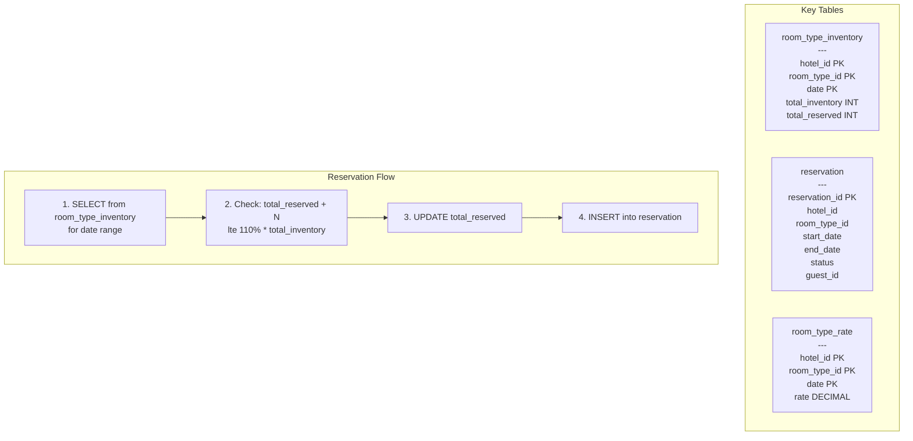

## Summary

The hotel reservation data model is built around a key insight: guests reserve a **room type** (king, queen, standard), not a specific room number. The `room_type_inventory` table uses a composite primary key of `(hotel_id, room_type_id, date)` with `total_inventory` and `total_reserved` columns. Rows are pre-populated for all future dates within 2 years. A reservation check verifies `total_reserved + requested <= 110% * total_inventory` for each date in the range, supporting the 10% overbooking requirement.

## How It Works

1. **Pre-populate**: a daily scheduled job inserts inventory rows for future dates (5,000 hotels x 20 room types x 730 days = 73M rows)
2. **Query**: SELECT all rows for the requested hotel, room type, and date range
3. **Validate**: for each date, check that `total_reserved + rooms_requested <= 110% * total_inventory`
4. **Reserve**: UPDATE `total_reserved` and INSERT a new reservation record
5. **Status machine**: reservation status transitions through pending, paid, refunded, canceled, rejected

## When to Use

- Booking systems where the reserved unit is a category (room type, ticket class, seat section) rather than a specific instance
- When overbooking is a business requirement (hotels, airlines)
- When the total data volume fits comfortably in a single relational database (73M rows for hotel chains)

## Trade-offs

| Aspect | Benefit | Cost |
|---|---|---|
| One row per date | Simple range queries, easy overbooking logic | 73M rows for 5,000 hotels (manageable) |
| Room type vs specific room | Matches hotel business model | Room assignment deferred to check-in |
| Relational database | ACID guarantees for concurrent reservations | Harder to scale writes than NoSQL |
| Pre-populated inventory | Fast reads, no on-the-fly generation | Requires daily batch job for new dates |
| 110% overbooking factor | Compensates for cancellations | Risk of walking guests if everyone shows up |

## Real-World Examples

- **Marriott / Hilton**: room-type-based reservation systems with overbooking
- **Airlines**: similar inventory model (seat class instead of room type) with overbooking
- **Airbnb**: uses specific listing_id (not room type) since each property is unique
- **Movie theaters**: seat-section-based or specific-seat-based depending on the venue

## Common Pitfalls

- Modeling reservations against specific room IDs (hotel guests do not choose room numbers at booking time)
- Not pre-populating the inventory table (creates race conditions on first reservation for a date)
- Forgetting to archive old reservation data (millions of historical rows slow down queries)
- Implementing overbooking as a boolean flag instead of a configurable percentage

## See Also

- [[concurrency-control]] -- preventing double-booking when two users reserve simultaneously
- [[idempotent-reservation-api]] -- preventing duplicate reservations from repeated clicks
- [[database-sharding-and-caching]] -- scaling the inventory table for high-traffic scenarios
