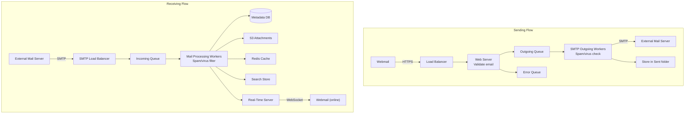

## Summary

A distributed mail server architecture separates concerns into **web servers** (HTTP API), **real-time servers** (WebSocket push for new emails), and a **storage layer** comprising a metadata database, S3 attachment store, Redis cache, and search store. **Message queues** decouple the sending and receiving flows, enabling independent scaling of SMTP workers, mail processing workers, and web servers. The sending flow goes through an outgoing queue with spam/virus checks; the receiving flow goes through an incoming queue to mail processing workers that store, cache, index, and push-notify.

## How It Works

1. **Sending**: User composes email -> web server validates -> outgoing queue -> SMTP workers check spam/virus -> send via SMTP -> store in Sent folder
2. **Receiving**: External server delivers via SMTP -> incoming queue -> mail workers filter spam -> store in DB/S3/cache/search -> push via WebSocket if user is online
3. **Real-time servers**: maintain persistent WebSocket connections; push new emails immediately to online users
4. **Offline users**: fetch new emails via HTTP API on next login
5. **Message queues**: decouple producers (web servers, SMTP receivers) from consumers (workers), allowing independent scaling

## When to Use

- Any email system serving more than a few thousand users
- When sending and receiving volumes differ significantly (receiving is typically 4x sending)
- When you need real-time push notifications for new emails
- When spam/virus processing must scale independently from user-facing web servers

## Trade-offs

| Aspect | Benefit | Cost |
|---|---|---|
| WebSocket for real-time | Instant push, bidirectional | Browser compatibility; stateful servers |
| Long polling fallback | Universal browser support | Higher server load, more latency |
| Outgoing queue | Absorbs spikes, retry logic | Added latency for send confirmation |
| Direct SMTP send (no queue) | Lower latency | No retry capability, cascading failures |
| Separate spam/virus workers | Independent scaling, specialized | More infrastructure components |
| Inline spam check (in web server) | Simpler architecture | Cannot scale spam processing independently |
| S3 for attachments | Scalable to 25MB+, cheap storage | Extra hop for attachment retrieval |

## Real-World Examples

- **Gmail**: distributed architecture with custom metadata DB, GCS for attachments, WebSocket push
- **Microsoft Outlook**: uses Exchange servers with ActiveSync for mobile push
- **Apache James**: open-source mail server implementing JMAP subprotocol over WebSocket
- **ProtonMail**: end-to-end encrypted architecture with separate key servers

## Common Pitfalls

- Not decoupling send/receive with queues (a surge in incoming spam can take down the sending path)
- Storing attachments in the metadata database (blob data causes cache pollution and storage issues)
- Not monitoring queue sizes (growing queues indicate SMTP delivery failures or insufficient workers)
- Implementing only HTTP polling without WebSocket (users see delayed emails, poor experience)

## See Also

- [[email-protocols]] -- the SMTP/IMAP/POP protocols underlying server-to-server communication
- [[email-data-model]] -- the NoSQL schema for metadata storage
- [[email-scalability-availability]] -- replicating this architecture across data centers
