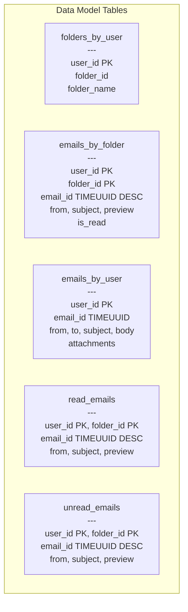

## Summary

The email data model is designed around **access patterns** rather than normalization. Tables use `user_id` as the **partition key** so all data for one user lives on a single shard. The `emails_by_folder` table uses a composite partition key `(user_id, folder_id)` with **TIMEUUID clustering** for chronological sort. Since NoSQL cannot filter on non-key columns efficiently, read/unread filtering is achieved via **denormalization** into separate `read_emails` and `unread_emails` tables, trading write complexity for fast reads at scale.

## How It Works

1. **Query 1 -- Get folders**: `SELECT * FROM folders_by_user WHERE user_id = ?`
   - Partition key is user_id; all folders for one user in one partition
2. **Query 2 -- List emails in folder**: `SELECT * FROM emails_by_folder WHERE user_id = ? AND folder_id = ?`
   - Composite partition key (user_id, folder_id); TIMEUUID clustering sorts newest first
3. **Query 3 -- Get email detail**: `SELECT * FROM emails_by_user WHERE email_id = ?`
   - Attachments stored as a list of (filename, size) references; actual files in S3
4. **Query 4 -- Unread emails**: `SELECT * FROM unread_emails WHERE user_id = ? AND folder_id = ?`
   - Marking read = DELETE from unread_emails + INSERT to read_emails (denormalized)
5. **Threading**: email headers (Message-Id, In-Reply-To, References) reconstruct conversation trees

## When to Use

- Email systems with billions of users where each user's data must be isolated on one shard
- Any NoSQL system where queries cannot filter on non-key columns efficiently
- When read performance on specific query patterns is more important than write simplicity

## Trade-offs

| Aspect | Benefit | Cost |
|---|---|---|
| Partition by user_id | All user data co-located; simple sharding | Messages not shared between users |
| TIMEUUID clustering | Natural chronological order, unique IDs | Larger keys than integer IDs |
| Denormalized read/unread tables | Fast filtered queries without scanning | Marking read requires delete + insert |
| Single emails_by_folder table | Simpler schema, fewer writes | Cannot efficiently filter by is_read in NoSQL |
| Separate attachments in S3 | Handles 25MB+ files; scalable | Extra retrieval hop; two storage systems |
| Inline attachment in DB (BLOB) | Single system | 1MB practical limit in Cassandra; cache pollution |

## Real-World Examples

- **Gmail**: custom Bigtable-based storage with user_id partitioning
- **Yahoo Mail**: migrated from RDBMS to a custom NoSQL store for email metadata
- **Microsoft Exchange**: hybrid storage model optimized for email access patterns
- **ProtonMail**: encrypted NoSQL storage with per-user partitioning

## Common Pitfalls

- Trying to use a relational database for email metadata at scale (BLOB types are inefficient for email bodies)
- Querying non-key columns in NoSQL (e.g., filtering by is_read on emails_by_folder without denormalization)
- Not using TIMEUUID for email_id (regular UUIDs are not time-ordered, breaking chronological queries)
- Forgetting to handle the denormalization consistency (what if the delete succeeds but the insert fails?)

## See Also

- [[distributed-mail-architecture]] -- the overall system that uses this data model
- [[email-search]] -- search indexes that complement the primary data model
- [[email-scalability-availability]] -- how this model scales across data centers
