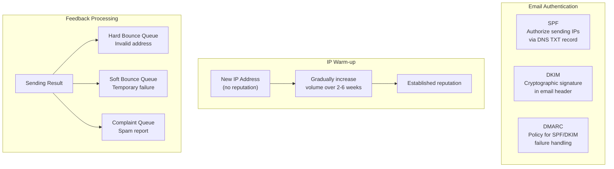

## Summary

Getting emails delivered to inboxes (not spam folders) is one of the hardest operational challenges. **Email deliverability** requires dedicated sending IPs, separating email categories (transactional vs marketing), slow IP warm-up over 2-6 weeks, and rapid spammer banning. Authentication uses **SPF** (authorized sending IPs), **DKIM** (cryptographic signature), and **DMARC** (policy for handling authentication failures). **Feedback loops** with ISPs process hard bounces (invalid address), soft bounces (temporary failure), and complaints (spam reports) through separate queues.

## How It Works

1. **Dedicated IPs**: use separate IP addresses for sending (shared IPs carry other senders' reputations)
2. **Email classification**: send marketing and transactional emails from different IPs (marketing spam complaints do not affect transactional delivery)
3. **IP warm-up**: start with low volume on new IPs and gradually increase over 2-6 weeks to build reputation
4. **SPF**: DNS TXT record listing authorized sending IPs for the domain
5. **DKIM**: private key signs the email; receiving server verifies with public key in DNS
6. **DMARC**: DNS record specifying what to do when SPF/DKIM fails (reject, quarantine, or none)
7. **Feedback loops**: process bounces and complaints through separate queues for targeted handling
8. **Ban spammers quickly**: detect and disable abusive accounts before they damage server reputation

## When to Use

- Any service that sends emails and wants them to reach inboxes
- When transitioning to new sending infrastructure (IP warm-up is mandatory)
- When operating at scale where ISP relationships and reputation management are critical

## Trade-offs

| Aspect | Benefit | Cost |
|---|---|---|
| Dedicated IPs | Full control over reputation | Must warm up each IP individually |
| Shared IPs | No warm-up needed | Other senders' behavior affects your reputation |
| Separate marketing/transactional IPs | Isolate reputation per category | More IPs to manage |
| Aggressive spam banning | Protects reputation quickly | May false-positive on legitimate users |
| Lenient spam policy | Fewer false positives | Spammers can damage reputation faster |
| SPF + DKIM + DMARC | Strong authentication, phishing prevention | Complex DNS configuration |
| No authentication | Simpler setup | Emails likely land in spam |

## Real-World Examples

- **Gmail**: enforces strict SPF/DKIM/DMARC checking; shows authentication status in headers
- **Amazon SES**: provides dedicated IP warm-up tooling and reputation dashboard
- **SendGrid/Mailgun**: managed deliverability with automatic IP warm-up and feedback processing
- **Microsoft 365**: Sender Reputation Protection (SRP) scores for incoming email filtering

## Common Pitfalls

- Sending high volume from a new IP without warm-up (immediate spam folder placement)
- Mixing marketing and transactional emails on the same IP (marketing complaints affect transactional delivery)
- Not setting up SPF/DKIM/DMARC records (major ISPs increasingly require all three)
- Ignoring bounce and complaint feedback (rising complaint rates lead to IP blocklisting)
- Not processing hard bounces (continued sending to invalid addresses is a spam signal)

## See Also

- [[email-protocols]] -- SMTP is the protocol over which deliverability is evaluated
- [[distributed-mail-architecture]] -- the sending flow where deliverability matters
- [[email-scalability-availability]] -- scaling email sending across multiple IPs and data centers
