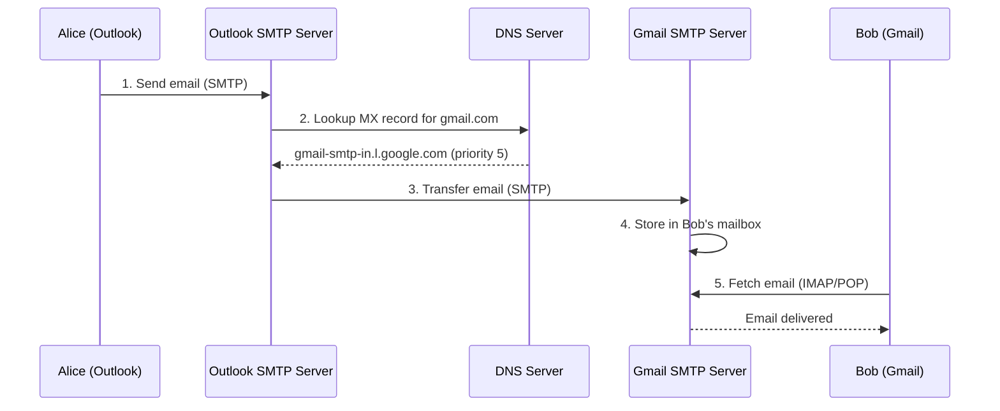

## Summary

Email relies on several protocols for different stages of its lifecycle. **SMTP** (Simple Mail Transfer Protocol) is the standard for sending emails between servers. **POP** (Post Office Protocol) downloads emails to a device and deletes them from the server (single-device access). **IMAP** (Internet Message Access Protocol) syncs on-demand and keeps emails on the server (multi-device access). Modern webmail uses **HTTPS** with custom protocols like ActiveSync. **DNS MX records** route emails to the correct receiving mail server by priority.

## How It Works

1. Alice composes an email in Outlook and presses "Send" -- the client communicates with the Outlook mail server via **SMTP**
2. The Outlook server queries **DNS** for the recipient domain's **MX record** (mail exchanger)
3. MX records return a list of mail servers with **priority numbers** (lower = preferred)
4. The Outlook server connects to the highest-priority Gmail SMTP server and transfers the email
5. Gmail stores the email in Bob's mailbox
6. Bob retrieves the email using **IMAP** (on-demand sync) or **POP** (full download)

## When to Use

| Protocol | Use Case |
|---|---|
| **SMTP** | Server-to-server email transfer; client-to-server email sending |
| **IMAP** | Multi-device access; enterprise email; users who want server-side storage |
| **POP** | Single-device access; offline-first; limited server storage |
| **HTTPS** | Modern webmail (Gmail, Outlook web); rich interactive features |

## Trade-offs

| Aspect | Benefit | Cost |
|---|---|---|
| SMTP | Universal standard, all mail servers support it | Limited functionality (sending only) |
| IMAP | Multi-device sync, server-side storage | Requires persistent connection for sync |
| POP | Simple, works offline | Single-device only, emails deleted from server |
| HTTPS (webmail) | Rich features, no protocol limitations | Requires custom implementation per provider |
| MX record with priorities | Automatic failover to backup servers | DNS propagation delays affect routing |

## Real-World Examples

- **Gmail**: HTTPS for webmail, IMAP/POP for third-party clients, SMTP for sending
- **Microsoft Outlook**: HTTPS with ActiveSync for mobile, IMAP/POP for desktop clients
- **Yahoo Mail**: IMAP support for external clients, HTTPS for web interface
- **Corporate email**: typically IMAP + SMTP with Exchange ActiveSync for mobile

## Common Pitfalls

- Assuming POP and IMAP can send emails (they are receive-only protocols; SMTP handles sending)
- Not understanding MX record priorities (lower number = higher priority, not the other way around)
- Using POP for users who need multi-device access (emails are deleted from the server after download)
- Ignoring the limitations of legacy protocols when designing modern email features (threading, labels, search)

## See Also

- [[distributed-mail-architecture]] -- how modern mail servers go beyond these protocols
- [[email-deliverability]] -- SMTP-level authentication (SPF, DKIM, DMARC)
- [[email-scalability-availability]] -- scaling the server infrastructure behind these protocols
