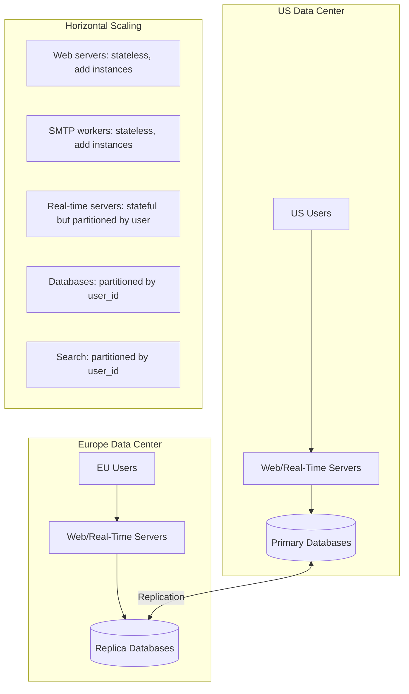

## Summary

A distributed email service at Gmail scale achieves scalability through **horizontal scaling** of stateless components and **user_id-based partitioning** of data. **Multi-datacenter replication** ensures availability and geographic proximity. The system deliberately **favors consistency over availability**: during failover, a mailbox is paused (unavailable) rather than serving potentially stale or conflicting data. Attachments at petabyte scale use **S3 object storage**, and most components can scale independently because user data access patterns are isolated.

## How It Works

1. **User-level independence**: email access patterns are per-user, so most operations touch only one shard
2. **Stateless components** (web servers, SMTP workers) scale by adding more instances
3. **Stateful components** (real-time servers) are partitioned by user_id via consistent hashing
4. **Database partitioning**: user_id as partition key ensures co-location of all user data
5. **Multi-datacenter replication**: data is replicated across geographies for disaster recovery
6. **Consistency choice**: during failover, the system pauses the affected mailbox rather than serving from a potentially inconsistent replica
7. **S3 for attachments**: PB-scale storage with cross-region replication built in

## When to Use

- Any system with per-user data isolation (email, messaging, personal document storage)
- When data loss is unacceptable and consistency must be prioritized over availability
- When users are distributed globally and need low-latency access to their data

## Trade-offs

| Aspect | Benefit | Cost |
|---|---|---|
| Consistency over availability | No stale/conflicting reads | Mailbox unavailable during failover |
| Availability over consistency | Always accessible | Risk of reading stale data or conflicts |
| Multi-datacenter active-active | Low latency everywhere | Cross-region consistency is complex |
| Multi-datacenter active-passive | Simpler consistency | Failover latency; distant users experience higher latency |
| User_id partitioning | Natural for email; simple sharding | Cannot share emails between users |
| S3 for attachments | Infinite scale, cross-region replication | Extra network hop for retrieval |
| Inline attachment storage | Single read for email + attachment | Database bloat, cache pollution |

## Real-World Examples

- **Gmail**: custom distributed infrastructure across global data centers, favoring consistency
- **Microsoft Outlook (Exchange Online)**: multi-datacenter with Database Availability Groups (DAGs)
- **Yahoo Mail**: migrated to a distributed architecture with per-user partitioning
- **iCloud Mail**: Apple's multi-datacenter infrastructure with cross-region replication

## Common Pitfalls

- Choosing availability over consistency for email (users strongly prefer "no access" over "lost or duplicated emails")
- Not replicating across data centers (single-region deployment is a single point of failure)
- Storing attachments in the primary database at PB scale (causes storage and performance issues)
- Assuming all email components scale the same way (real-time WebSocket servers are stateful and need different scaling strategies)

## See Also

- [[distributed-mail-architecture]] -- the system components that this scaling strategy applies to
- [[email-data-model]] -- the partition key design that enables horizontal scaling
- [[email-search]] -- scaling the search index alongside the primary data store
