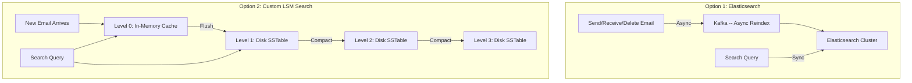

## Summary

Email search is **write-heavy** (reindex on every send, receive, and delete) and **read-light** (only when a user manually searches). This is the opposite of web search. Two approaches are compared: **Elasticsearch** offers easy integration and full-text search but requires maintaining two data systems in sync. A **custom search engine** using **LSM trees** (Log-Structured Merge-Trees) optimizes for the write-heavy pattern by performing only sequential disk writes. Large email providers typically embed search natively in their datastore to avoid the two-system consistency problem.

## How It Works

### Elasticsearch Approach
1. Email events (send, receive, delete) trigger asynchronous reindexing via Kafka
2. Elasticsearch indexes email metadata (from, subject, body) using inverted indexes
3. Search queries are synchronous -- user waits for results
4. Documents partitioned by user_id so searches are local to one shard

### Custom LSM Approach
1. New emails are written to **Level 0 in-memory cache** (fast sequential write)
2. When memory threshold is reached, data is **flushed to Level 1** on disk as an SSTable
3. Background **compaction** merges smaller SSTables into larger ones at deeper levels
4. Separates frequently-changing data (folders) from static data (email content)
5. LSM trees are the core data structure behind Bigtable, Cassandra, and RocksDB

## When to Use

| Approach | Best For |
|---|---|
| **Elasticsearch** | Small-to-medium email services; rapid development |
| **Custom LSM engine** | Gmail/Outlook scale; write-optimized; tight integration |
| **Hybrid** | Elasticsearch for search, primary DB for storage (accept sync complexity) |

## Trade-offs

| Aspect | Benefit | Cost |
|---|---|---|
| Elasticsearch | Easy integration, full-text search | Two systems to maintain; data sync complexity |
| Custom LSM search | Single system, write-optimized | Massive engineering effort |
| Kafka-based reindex | Decoupled, async | Search index lags behind email state |
| Inline indexing (no Kafka) | Immediate consistency | Slower email operations |
| User_id partitioning | Searches are local, fast | Cross-user search impossible |
| Global index | Cross-user search possible | Much larger index, complex routing |

## Real-World Examples

- **Gmail**: custom search engine embedded in Bigtable infrastructure
- **Microsoft Exchange**: native search with configurable index scopes
- **Yahoo Mail**: Elasticsearch-based email search
- **Apple iCloud Mail**: search powered by custom infrastructure
- **Elasticsearch**: used by Mailchimp, HubSpot for email-related search

## Common Pitfalls

- Treating email search like web search (email is write-heavy, web search is read-heavy)
- Using synchronous reindexing for email operations (slows down send/receive for search updates)
- Not partitioning the search index by user_id (searches become expensive cross-shard operations)
- Ignoring the disk I/O bottleneck for custom search (PB-scale data requires write-optimized structures like LSM)

## See Also

- [[email-data-model]] -- the primary data store that the search index complements
- [[distributed-mail-architecture]] -- the overall system containing the search component
- [[email-scalability-availability]] -- scaling search across data centers
