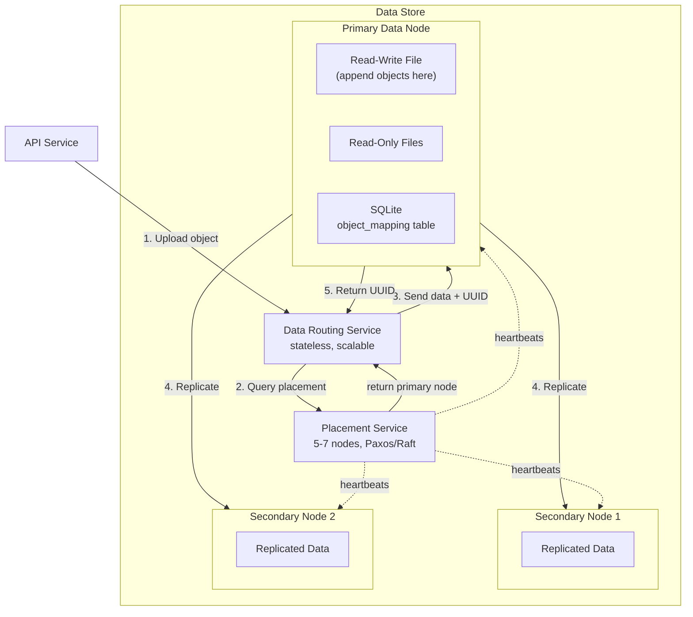

## Summary

The data store in S3-like object storage uses three components: a **data routing service** (stateless, provides REST/gRPC APIs), a **placement service** (5-7 node Paxos/Raft cluster maintaining a virtual cluster map), and **data nodes** (the actual storage servers). Small objects are appended into large WAL-style files to avoid inode exhaustion and wasted disk blocks. Each data node runs a local SQLite database to map object UUIDs to (file_name, start_offset, object_size). The placement service uses heartbeats to track node health and consistent hashing to assign objects to replication groups across failure domains.

## How It Works

### WAL-Style Object Append

1. New objects are appended to the current **read-write file** on the data node
2. When the read-write file reaches capacity (several GBs), it is sealed as **read-only**
3. A new read-write file is created for incoming objects
4. Each CPU core gets a dedicated read-write file to avoid serialization bottlenecks
5. The local SQLite `object_mapping` table records: object_id, file_name, start_offset, object_size

### Placement and Replication

- Placement service maintains a **virtual cluster map**: root -> datacenter -> rack -> node
- Consistent hashing maps object UUID to a replication group
- Replicas are placed across **different failure domains** (AZs, racks) for maximum durability
- Nodes that miss heartbeats for 15 seconds are marked down in the cluster map

## When to Use

- Any system storing billions of small-to-medium objects where inode limits are a concern
- When sequential disk I/O throughput matters more than random access latency
- Distributed storage requiring deterministic, topology-aware data placement
- Systems that need strong durability guarantees via cross-AZ replication

## Trade-offs

| Benefit | Cost |
|---------|------|
| WAL append avoids inode exhaustion | Object lookup requires an extra DB query (UUID to offset) |
| Sequential I/O is fast for writes | Read-write file serialization without per-core files |
| SQLite is simple and embedded | SQLite per node means no cross-node object_mapping queries |
| Placement service ensures failure-domain isolation | Placement service is a single logical cluster (must be HA) |
| Consistent hashing minimizes data movement on node changes | Adding/removing nodes still requires some rebalancing |

## Real-World Examples

- **HDFS** -- DataNodes store blocks in local files, NameNode tracks block locations
- **Haystack (Facebook)** -- Merges small photos into large "superblocks" with in-memory index
- **Ambry (LinkedIn)** -- Appends blobs to large files, replicated across data centers
- **Ceph OSD** -- Each OSD daemon manages local storage with placement via CRUSH map

## Common Pitfalls

- Storing each small object as its own file (inode exhaustion, wasted disk blocks)
- Single read-write file per node without per-core files (write serialization bottleneck)
- Not running the placement service as an HA cluster (single point of failure)
- Placing all replicas in the same rack or AZ (correlated failure risk)
- Choosing RocksDB over SQLite for the object mapping (RocksDB is write-optimized but reads are slower, and this workload is read-heavy)

## See Also

- [[metadata-data-separation]] -- How metadata and data stores are decoupled
- [[erasure-coding]] -- Alternative to replication for durability
- [[garbage-collection-compaction]] -- Reclaiming space from sealed read-only files
