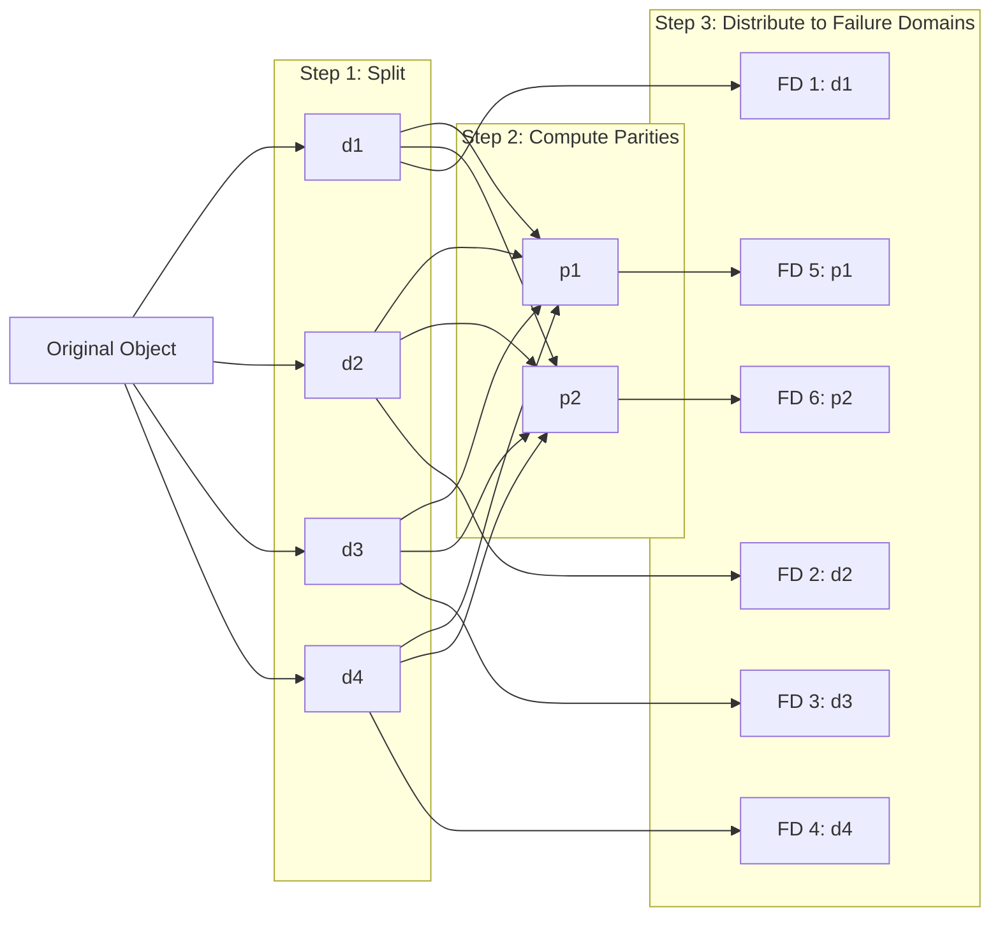

## Summary

Erasure coding is a data protection scheme that splits an object into k data chunks and computes m parity chunks using mathematical formulas (typically Reed-Solomon). Any k of the total (k + m) chunks can reconstruct the original data, meaning the system tolerates up to m simultaneous node failures. An (8+4) erasure coding setup achieves approximately 11 nines of durability with only 50% storage overhead, compared to 200% for 3-copy replication. The trade-off is higher read/write latency and computational cost for parity calculation.

## How It Works

1. **Split**: Original data is divided into k equal-sized data chunks
2. **Parity computation**: m parity chunks are computed using Reed-Solomon encoding
3. **Distribute**: All (k + m) chunks are placed on separate failure domains
4. **Reconstruction**: If any chunks are lost, the original data is rebuilt from any k surviving chunks
5. **Verification**: Checksums (e.g., MD5) are stored per chunk and per file for corruption detection

| Scheme | Data Chunks | Parity Chunks | Total | Max Failures Tolerated | Storage Overhead |
|---|---|---|---|---|---|
| (4+2) | 4 | 2 | 6 | 2 | 50% |
| (8+4) | 8 | 4 | 12 | 4 | 50% |
| 3-copy replication | 1 | 2 copies | 3 | 2 | 200% |

## When to Use

- Object storage and archival systems where storage cost is the primary concern
- When durability requirements exceed what 3-copy replication can provide (beyond 6 nines)
- Cold or warm data where slightly higher access latency is acceptable
- Systems with enough failure domains (nodes, racks, AZs) to distribute chunks

## Trade-offs

| Benefit | Cost |
|---------|------|
| 11 nines durability (8+4) vs 6 nines (3-copy) | Higher write latency due to parity computation |
| 50% storage overhead vs 200% (3-copy) | Higher read latency (must gather k chunks from different nodes) |
| Tolerates more simultaneous failures | More complex data node design |
| Significant cost savings at petabyte scale | Degraded read performance during node failures (reconstruction) |
| Checksums enable corruption detection | CPU overhead for encoding/decoding |

## Real-World Examples

- **Amazon S3** -- Uses erasure coding for standard storage class
- **Google Colossus** -- Reed-Solomon encoding for Google's distributed file system
- **Azure Storage** -- Local Reconstruction Codes (LRC), an advanced erasure coding variant
- **Ceph** -- Supports both replication and erasure coding pools
- **Backblaze B2** -- Reed-Solomon (17+3) for vault-level durability

## Common Pitfalls

- Using erasure coding for latency-sensitive hot data (replication is better for hot paths)
- Not placing chunks in truly independent failure domains (co-located chunks defeat the purpose)
- Forgetting that reads require k network round trips in normal operation (not 1 like replication)
- Ignoring the CPU cost of parity computation for high write-throughput workloads
- Not combining erasure coding with checksum verification (corrupted chunks silently pollute reconstruction)

## See Also

- [[data-persistence-and-routing]] -- How data nodes store and replicate chunks
- [[object-storage-fundamentals]] -- Core object storage concepts
- [[garbage-collection-compaction]] -- Cleaning up corrupted or deleted chunks
