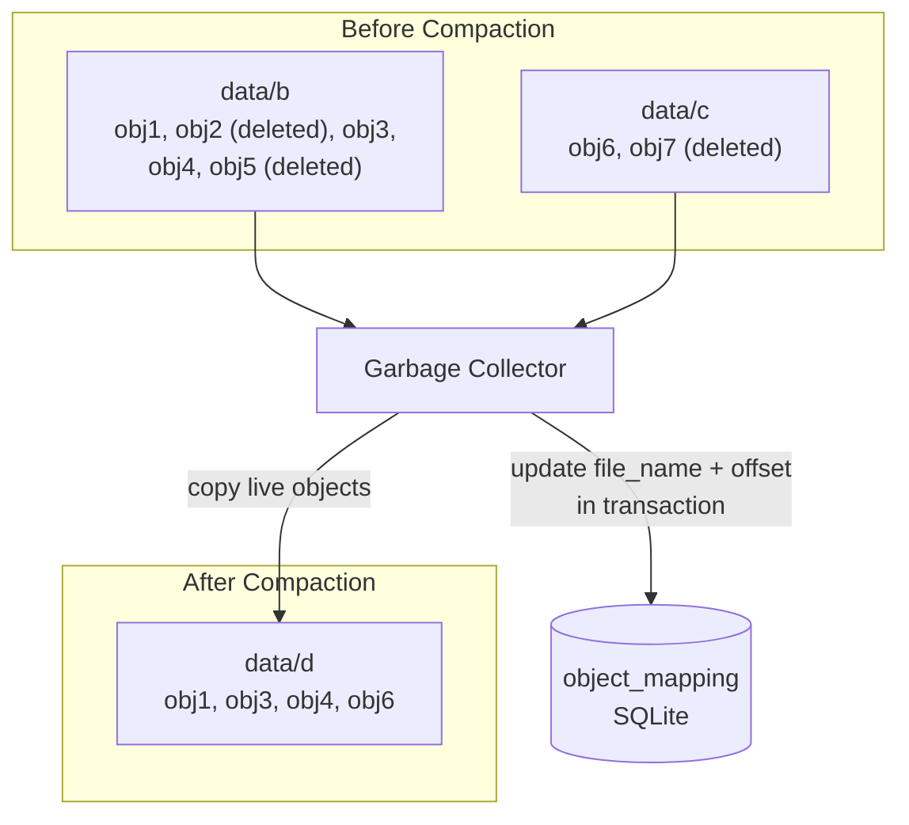

## Summary

In S3-like object storage, deleted objects are lazily marked rather than immediately removed. A garbage collector periodically compacts read-only data files by copying only live objects to new files and updating the object_mapping table. This process also handles orphaned multipart upload parts and corrupted data flagged by checksum verification. Compaction reduces fragmentation, reclaims disk space, and consolidates many small files into fewer large files.

## How It Works

1. **Identify garbage**: Objects marked as deleted, orphaned multipart parts, corrupted data
2. **Wait for threshold**: GC waits until enough read-only files accumulate to make compaction worthwhile
3. **Copy live objects**: GC reads read-only files, skips deleted/orphaned/corrupt entries, writes live objects to new files
4. **Update mapping**: The `object_mapping` table is updated with new file_name and start_offset values, wrapped in a database transaction for atomicity
5. **Remove old files**: After successful mapping update, old read-only files are deleted
6. **Replica cleanup**: For replicated data, GC runs on all nodes (primary + secondaries); for erasure coding (8+4), GC runs on all 12 nodes

**Sources of garbage:**

| Type | Source | Example |
|---|---|---|
| Lazy-deleted objects | DELETE API marks objects, does not remove | User deletes a file |
| Orphaned multipart parts | Upload initiated but never completed | Network failure mid-upload |
| Corrupted data | Checksum verification failure | Disk bit-rot |
| Expired versions | Lifecycle policy removes old versions | Retention policy cleanup |

## When to Use

- Any append-only or WAL-style storage system where deletes are deferred
- Systems with multipart or staged uploads that can leave orphaned data
- When disk utilization must be kept below a threshold for performance
- Storage systems that need to consolidate fragmented small files

## Trade-offs

| Benefit | Cost |
|---------|------|
| Deletes are instant (just set a flag) | Space is not immediately reclaimed |
| Compaction consolidates fragmented files | Compaction uses CPU, disk I/O, and temporary extra space |
| Atomic mapping updates prevent data loss | Must coordinate across replicas for consistency |
| Handles multiple garbage types uniformly | GC scheduling must balance space recovery vs I/O impact |
| Reduces total file count (fewer inodes) | Brief write amplification during compaction |

## Real-World Examples

- **HBase / Cassandra** -- LSM-tree compaction merges SSTables, removing tombstones
- **LevelDB / RocksDB** -- Multi-level compaction to reclaim deleted key space
- **Amazon S3** -- Internal garbage collection for deleted and versioned objects
- **HDFS** -- Block garbage collection for unreferenced blocks after file deletion
- **Haystack (Facebook)** -- Compaction of needle files to remove deleted photos

## Common Pitfalls

- Running GC too aggressively (competes with production read/write I/O)
- Running GC too infrequently (disk fills up, especially with many deletes or abandoned uploads)
- Not wrapping mapping table updates in a transaction (partial updates corrupt the index)
- Forgetting to compact across all replicas (stale data remains on secondaries)
- Not monitoring disk utilization to trigger emergency compaction when space is critically low

## See Also

- [[data-persistence-and-routing]] -- How objects are appended to WAL-style files
- [[object-versioning]] -- Delete markers that create garbage for GC
- [[multipart-upload]] -- Orphaned parts that need cleanup
