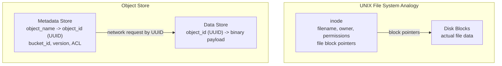

## Summary

S3-like object storage separates the metadata store (object names, versions, ACLs, bucket info) from the data store (binary object payloads identified by UUID). This is directly inspired by the UNIX file system where inodes store file metadata and block pointers, while the actual data lives in disk blocks. The separation enables independent scaling, optimization, and replication of each component. Metadata is mutable (versions change, ACLs update); data is immutable once written.

## How It Works

1. Client sends PUT with object name and data payload
2. API service writes data to the data store, receives a UUID back
3. API service creates a metadata entry mapping (bucket_name, object_name) to the UUID
4. On GET, the metadata store resolves the object name to a UUID, then the data store returns the payload
5. Each store uses different database technology optimized for its access pattern

**Metadata schema:**

| Table | Key Columns | Purpose |
|---|---|---|
| bucket | bucket_name, bucket_id, owner_id, enable_versioning | Bucket registry |
| object | bucket_name, object_name, object_version, object_id | Object URI to UUID mapping |

**Metadata sharding strategies:**

| Strategy | Pros | Cons |
|---|---|---|
| Shard by bucket_id | All objects in one shard | Hotspots (buckets with billions of objects) |
| Shard by object_id | Even distribution | Cannot query by URI efficiently |
| Shard by hash(bucket_name, object_name) | Even + URI-queryable | Prefix listing requires cross-shard aggregation |

## When to Use

- Any storage system where access patterns for metadata and data differ significantly
- When metadata is small and mutable but data is large and immutable
- When metadata and data need different replication, caching, or scaling strategies
- Systems requiring independent optimization of read/write paths

## Trade-offs

| Benefit | Cost |
|---------|------|
| Independent scaling of metadata and data | Two systems to operate and monitor |
| Metadata can use SQL; data can use append-only files | Extra network hop to resolve name to UUID |
| Immutable data simplifies replication and caching | Metadata consistency is critical (UUID mapping must be accurate) |
| Different durability guarantees per layer | Garbage collection needed to clean orphaned data |
| Each component optimized for its workload | Schema design must support all query patterns |

## Real-World Examples

- **Amazon S3** -- Metadata in DynamoDB-like store, data in distributed blob storage
- **HDFS** -- NameNode (metadata) separated from DataNodes (data blocks)
- **Ceph** -- RADOS objects store both, but the gateway layer separates bucket metadata
- **Google Colossus** -- Metadata server (successor to GFS master) separate from chunk servers

## Common Pitfalls

- Coupling metadata and data in the same store, limiting independent scaling
- Not handling the case where data is written but metadata creation fails (orphaned data)
- Forgetting to invalidate metadata cache when objects are deleted or versioned
- Using a sharding key for metadata that does not support the most common query patterns (URI-based lookup)
- Not accounting for the metadata store becoming the bottleneck on listing operations

## See Also

- [[object-storage-fundamentals]] -- Overall object storage concepts
- [[data-persistence-and-routing]] -- How the data store persists and routes objects
- [[object-versioning]] -- How versioning adds rows to the metadata store
