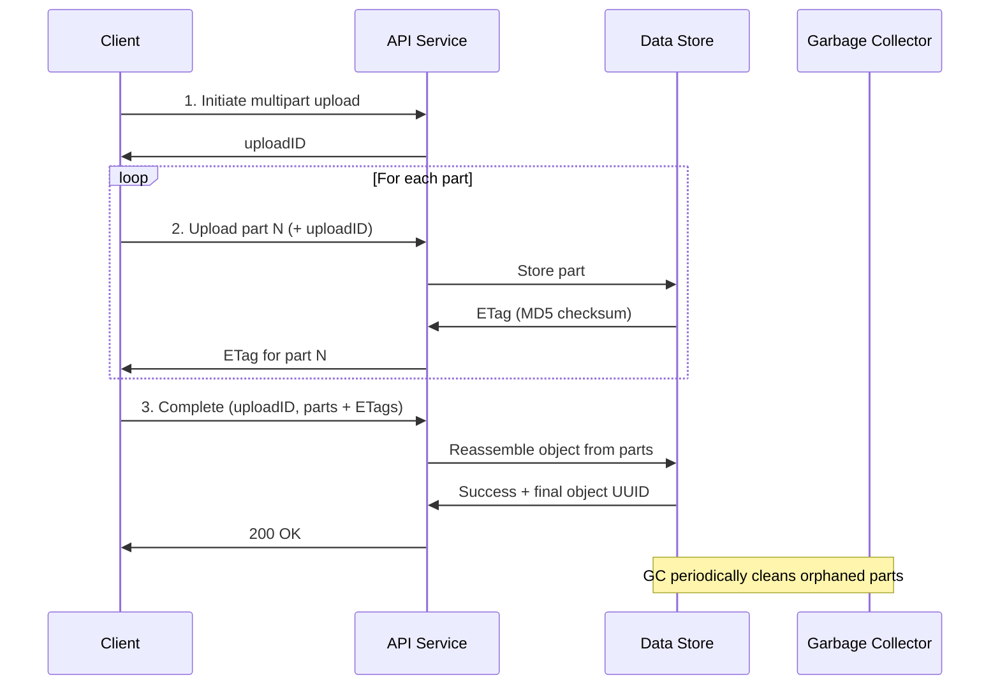

## Summary

Multipart upload enables uploading large objects (multi-GB) in smaller, independently transferred parts. The server returns an uploadID at initiation and an ETag (MD5 checksum) for each uploaded part. After all parts arrive, the client sends a completion request with part numbers and ETags, and the server reassembles the object. This makes large uploads resumable (a failed part can be retried without re-uploading everything) and parallelizable (multiple parts can be uploaded concurrently). Orphaned or abandoned parts are cleaned by the garbage collector.

## How It Works

1. **Initiate**: Client requests a multipart upload; server returns a unique uploadID
2. **Upload parts**: Each part (e.g., 200 MB of a 1.6 GB file) is uploaded with the uploadID
3. **ETag verification**: Server returns an MD5 checksum (ETag) for each part to verify integrity
4. **Complete**: Client sends the uploadID, all part numbers, and their ETags
5. **Reassemble**: Server reconstructs the full object from parts in order; may take minutes for very large files
6. **Cleanup**: After reassembly, the individual parts are no longer needed; garbage collector reclaims their space

## When to Use

- Uploading objects larger than 100 MB (required for multi-GB files)
- Unreliable network connections where retries are expected
- When upload parallelism is needed to maximize bandwidth utilization
- Any scenario requiring resumable uploads (mobile apps, large backups)

## Trade-offs

| Benefit | Cost |
|---------|------|
| Resumable: retry individual parts, not the whole file | More complex client and server logic |
| Parallel upload of parts maximizes throughput | Server must track uploadID state and part metadata |
| ETag checksum verifies each part's integrity | Reassembly step adds latency after all parts arrive |
| Network failure affects only one part, not the whole upload | Orphaned parts waste storage until GC runs |
| Works well for multi-GB and even TB-scale objects | Need garbage collection for abandoned uploads |

## Real-World Examples

- **Amazon S3** -- Multipart upload required for objects over 5 GB, recommended over 100 MB
- **Google Cloud Storage** -- Resumable uploads with similar part-based semantics
- **Azure Blob Storage** -- Block blobs use a block list (commit blocks then finalize)
- **MinIO** -- S3-compatible multipart upload API
- **Backblaze B2** -- Large file API with similar part upload and finish semantics

## Common Pitfalls

- Not implementing a timeout or expiration policy for abandoned multipart uploads (storage leak)
- Uploading parts sequentially instead of in parallel (wastes available bandwidth)
- Not validating ETags on the client side before sending the completion request
- Using parts that are too small (increases overhead) or too large (reduces resumability)
- Forgetting to handle the reassembly delay -- it can take minutes for very large objects

## See Also

- [[object-storage-fundamentals]] -- Core object upload/download workflows
- [[data-persistence-and-routing]] -- Where parts are physically stored
- [[garbage-collection-compaction]] -- Cleaning up orphaned and abandoned parts
