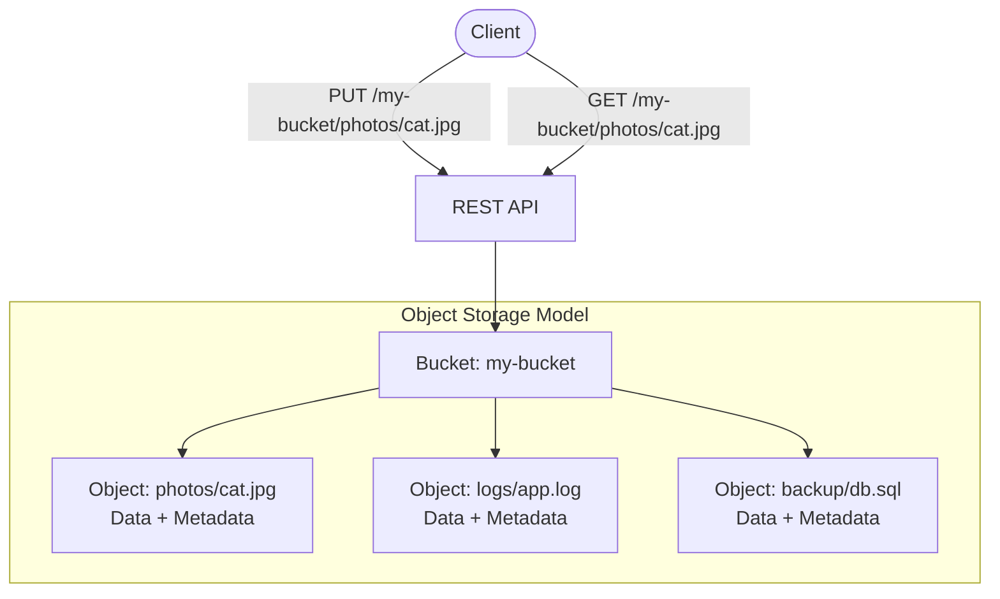

## Summary

Object storage stores data as flat, immutable objects accessed via RESTful APIs. Unlike block storage (raw disk blocks) or file storage (hierarchical directories), object storage trades performance for vast scale, high durability, and low cost. Each object consists of binary data (payload) and metadata (key-value pairs). Objects live in globally unique named **buckets**. The write-once, read-many access pattern (95% reads per LinkedIn research) and key-value lookup model (object URI is the key) drive every architectural decision.

## How It Works

1. Client creates a globally unique bucket via PUT request
2. Objects are uploaded into a bucket with a unique name (key)
3. Each object is identified by its URI: `s3://bucket-name/object-name`
4. Objects are immutable -- to modify, upload a new version or replace entirely
5. Retrieval uses the object URI as the key to fetch the data payload

| Storage Type | Abstraction | Mutability | Access | Scale | Cost |
|---|---|---|---|---|---|
| Block | Raw disk blocks | In-place update | SAS/iSCSI/FC | Medium | High |
| File | Hierarchical files | In-place update | SMB/NFS | High | Medium-High |
| Object | Flat key-value blobs | Immutable (replace only) | REST API | Vast | Low |

## When to Use

- Storing large volumes of unstructured data (images, videos, backups, logs)
- Archival and cold storage where access latency is acceptable
- When durability (6-11 nines) and cost efficiency are top priorities
- When data is written once and read many times
- Cloud-native applications that can use RESTful APIs

## Trade-offs

| Benefit | Cost |
|---------|------|
| Vast scalability (trillions of objects) | Higher access latency than block/file |
| Very low cost per GB | No in-place updates (immutable objects) |
| High durability via replication/erasure coding | Not suitable for transactional workloads |
| Simple REST API interface | No hierarchical directory structure (simulated via prefixes) |
| Write-once simplifies consistency | Need versioning for rollback capability |

## Real-World Examples

- **Amazon S3** -- The original cloud object store, 100+ trillion objects by 2021
- **Google Cloud Storage** -- Multi-region, lifecycle-managed object storage
- **Azure Blob Storage** -- Hot/cool/archive tiers for cost optimization
- **MinIO** -- Open-source S3-compatible object storage
- **Ceph RADOS Gateway** -- Distributed storage with S3-compatible API

## Common Pitfalls

- Treating object storage like a file system (no rename, no append, no partial update)
- Ignoring the 95/5 read/write ratio when designing the system (optimize for reads)
- Not enforcing globally unique bucket names at the metadata layer
- Assuming low-latency random access performance comparable to block storage
- Forgetting that "prefixes" in object names are not real directories

## See Also

- [[metadata-data-separation]] -- How metadata and data are decoupled
- [[data-persistence-and-routing]] -- How data is physically stored and routed
- [[erasure-coding]] -- Achieving extreme durability at low storage cost
