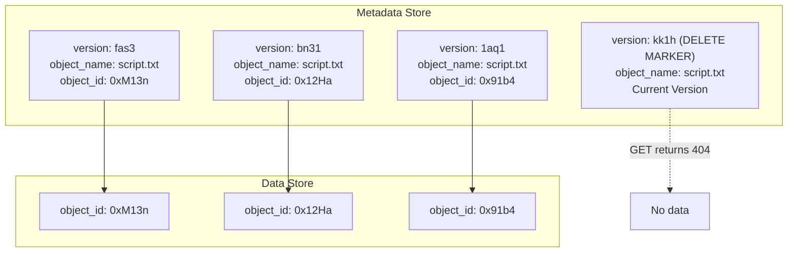

## Summary

Object versioning keeps multiple variants of an object in the same bucket. When enabled, every PUT creates a new metadata row with the same bucket_id and object_name but a new object_id (UUID) and object_version (TIMEUUID). The current version has the largest TIMEUUID. Deleting an object inserts a **delete marker** as the newest version rather than removing data, so GET returns 404 while all previous versions remain recoverable. This append-only approach to metadata avoids destructive updates and enables easy rollback.

## How It Works

1. Versioning must be **enabled at the bucket level** before it takes effect
2. Each PUT uploads data to the data store (returns a new UUID) and inserts a new metadata row
3. The `object_version` column uses a **TIMEUUID** -- a time-based UUID that sorts chronologically
4. The current version is the row with the largest TIMEUUID for a given (bucket_id, object_name)
5. DELETE inserts a delete marker (a version with no object_id), making GET return 404
6. Previous versions and their data remain in both the metadata and data stores
7. To restore, remove the delete marker or reference an older version explicitly

## When to Use

- When accidental overwrites or deletions must be recoverable
- Compliance or auditing requirements that demand a full change history
- Collaborative environments where multiple writers may conflict
- Any system where "undo" capability is a business requirement

## Trade-offs

| Benefit | Cost |
|---------|------|
| Full history of every object change | Increased metadata storage (one row per version) |
| Accidental deletes are recoverable (delete markers) | Old object data is never auto-cleaned (needs GC policy) |
| Append-only metadata (no destructive updates) | Listing versions adds query complexity |
| TIMEUUID provides natural chronological ordering | Must manage version lifecycle (expiration policies) |
| Enables point-in-time recovery | Higher write amplification (new metadata row + new data per PUT) |

## Real-World Examples

- **Amazon S3 Versioning** -- Enabled per bucket; each object version has a unique Version ID
- **Google Cloud Storage** -- Object versioning with configurable retention policies
- **Azure Blob Storage** -- Soft delete and blob versioning for recovery
- **MinIO** -- S3-compatible versioning with delete markers

## Common Pitfalls

- Enabling versioning without a lifecycle/expiration policy (storage grows unboundedly)
- Assuming DELETE actually removes data (it only inserts a delete marker)
- Not testing rollback procedures before an incident occurs
- Ignoring the cost of storing all old data versions in the data store
- Forgetting that the "current version" query must efficiently find the max TIMEUUID per object

## See Also

- [[metadata-data-separation]] -- How versioned metadata maps to immutable data blobs
- [[object-storage-fundamentals]] -- Core object immutability concepts
- [[garbage-collection-compaction]] -- Cleaning up old versions when policies dictate
