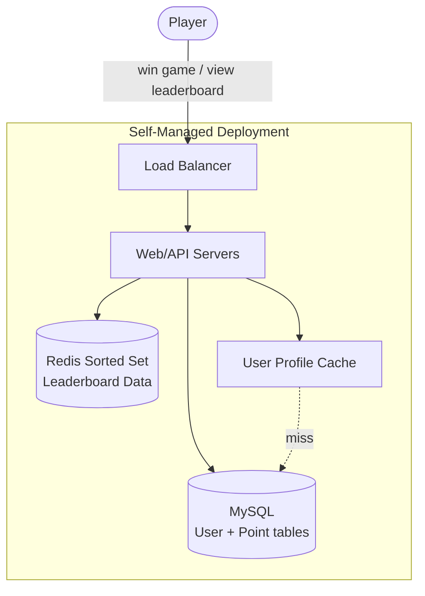
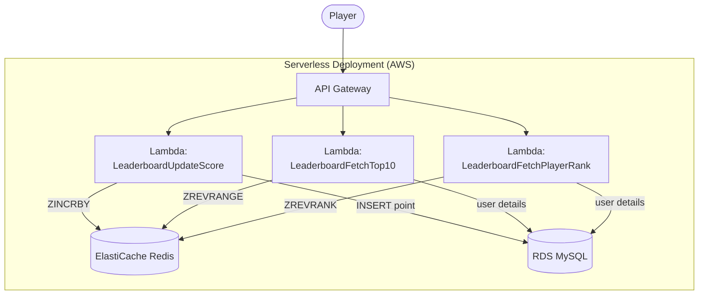

## Summary

The leaderboard system has two services: a **game service** that validates wins and a **leaderboard service** that manages rankings. Score updates are always server-side (never client-direct) to prevent cheating via man-in-the-middle attacks. The leaderboard service writes to a Redis sorted set for real-time ranking and to MySQL for durability and disaster recovery. A user profile cache speeds up top-10 lookups. Two deployment models are common: self-managed (Redis + MySQL + API servers) and serverless (API Gateway + Lambda + ElastiCache).

## How It Works

**API design:**

| Endpoint | Method | Purpose | Internal Call |
|---|---|---|---|
| /v1/scores | POST | Update score (game server only) | ZINCRBY + MySQL INSERT |
| /v1/scores | GET | Fetch top 10 leaderboard | ZREVRANGE 0 9 WITHSCORES |
| /v1/scores/:user_id | GET | Fetch user's rank | ZREVRANK |

**Security**: The POST endpoint is internal-only, callable only by the game service. Clients never set scores directly.

**Monthly rotation**: Each month creates a new Redis sorted set (`leaderboard_mar_2021`). Previous months' data is archived or moved to cold storage.

**Persistence and recovery**: Redis is configured with a read replica for fast failover. In catastrophic failure, the MySQL point table (user_id, score, timestamp) is replayed via ZINCRBY to rebuild the sorted set.

## When to Use

- Any competitive game or application requiring real-time ranking
- When peak QPS is moderate (2,500 updates/sec at 5M DAU) and fits a single Redis node
- When serverless auto-scaling is preferred over managing infrastructure
- When a durable backup (MySQL) is needed alongside an in-memory ranking store

## Trade-offs

| Benefit | Cost |
|---------|------|
| Server-side updates prevent cheating | Extra hop from game service to leaderboard service |
| Redis for speed + MySQL for durability | Two data stores to keep in sync |
| Serverless auto-scales with DAU | Lambda cold starts may add latency |
| User profile cache speeds top-10 display | Cache invalidation complexity |
| Monthly rotation bounds working set | Historical leaderboard queries need archive access |

## Real-World Examples

- **Clash Royale (Supercell)** -- Real-time ladder with seasonal resets
- **Fortnite (Epic Games)** -- Per-match and seasonal leaderboards
- **AWS GameLift** -- Managed game server with ElastiCache integration
- **Riot Games** -- Ranked ladder backed by Redis

## Common Pitfalls

- Allowing clients to call the score update endpoint directly (man-in-the-middle attack risk)
- Not recording scores in a durable store (MySQL) alongside Redis
- Forgetting to plan for monthly leaderboard rotation and archival
- Not configuring Redis read replicas for failover
- Using synchronous Lambda invocations without timeout/retry handling

## See Also

- [[redis-sorted-sets]] -- The data structure powering the leaderboard
- [[leaderboard-sharding]] -- Scaling beyond a single Redis node
- [[nosql-leaderboard]] -- Alternative DynamoDB-based approach
