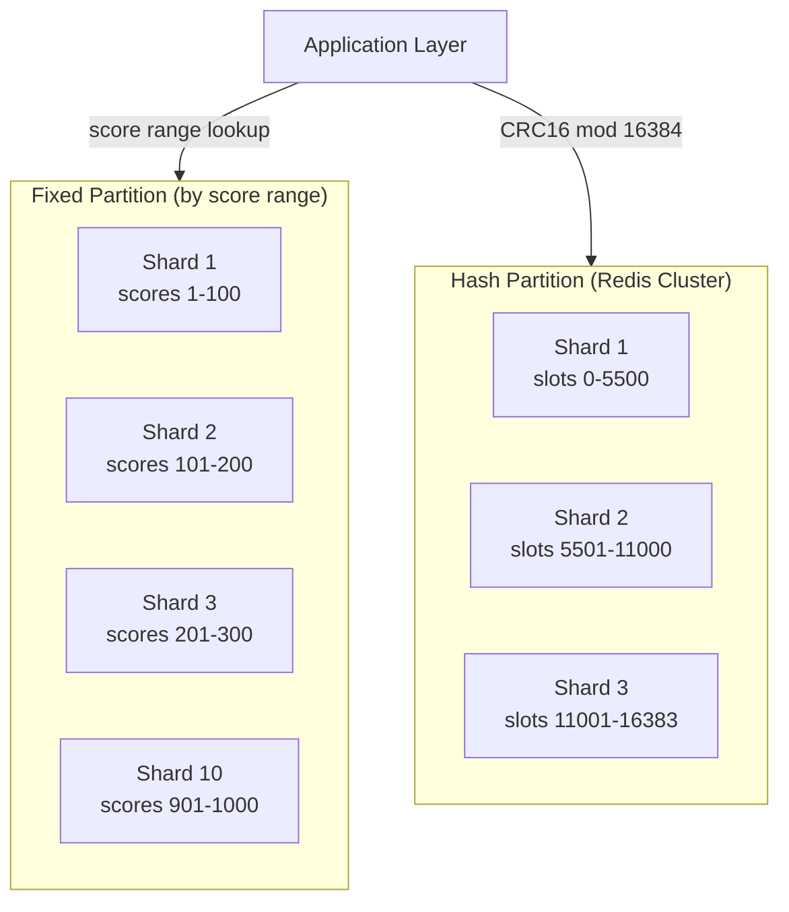

## Summary

At 500M DAU (100x the base design), the leaderboard grows to approximately 65 GB and 250,000 QPS -- too much for a single Redis node. Two sharding strategies are considered. **Fixed partition** shards by score range (e.g., 10 shards of 100-point ranges each), enabling exact rank computation by combining local rank with counts from higher shards. **Hash partition** (Redis Cluster with CRC16 mod 16384 slot assignment) provides automatic load balancing but requires scatter-gather for top-K and cannot compute exact ranks. Fixed partition is preferred for leaderboard use cases.

## How It Works

### Fixed Partition

1. Divide the total score range (e.g., 1-1000) into n shards with equal ranges
2. **Score update**: Look up user's current score (from a secondary cache or MySQL) to find the correct shard; if score crosses a shard boundary, remove from old shard and insert in new shard
3. **Top K**: Fetch top K from the shard with the highest score range
4. **User rank**: local_rank + SUM(count of players in all higher-score shards), where `INFO KEYSPACE` returns shard sizes in O(1)
5. May need adjustment if score distribution is uneven (some shards much larger than others)

### Hash Partition (Redis Cluster)

1. Each key is assigned to one of 16384 hash slots via `CRC16(key) % 16384`
2. Slots are distributed across Redis nodes; adding/removing nodes redistributes slots
3. **Score update**: Simple -- update the key in whatever shard it lives in
4. **Top K**: Must scatter the query to ALL shards, gather results, and sort in the application
5. **User rank**: No straightforward solution -- each shard only knows its local ordering

| Feature | Fixed Partition | Hash Partition |
|---|---|---|
| Top K query | Single shard (fast) | Scatter-gather all shards (slow) |
| Exact user rank | Yes (local rank + higher shard counts) | No (only approximate) |
| Load balance | May be uneven if scores cluster | Even by design |
| Score range crossing | Must move user between shards | Not applicable |
| Implementation | Application-managed | Redis Cluster managed |

## When to Use

- **Fixed partition**: When exact rank and efficient top-K are requirements
- **Hash partition**: When scores are highly clustered and even load distribution is critical
- **Either**: When a single Redis node cannot handle the storage or QPS requirements
- Consider whether approximate ranking (percentile) is acceptable before choosing

## Trade-offs

| Benefit | Cost |
|---------|------|
| Fixed: exact rank computation possible | Fixed: uneven shard sizes if scores cluster |
| Fixed: top-K from single shard (fast) | Fixed: cross-shard moves on score boundary crossing |
| Hash: automatic even distribution | Hash: scatter-gather for every top-K query |
| Hash: Redis Cluster handles slot management | Hash: no exact rank capability |
| Both: enable horizontal scaling to 500M+ DAU | Both: increased operational complexity |

## Real-World Examples

- **Supercell (Clash of Clans)** -- Score-range sharded leaderboards for trophy-based ranking
- **Riot Games** -- Regional leaderboard shards with periodic global aggregation
- **AWS ElastiCache Cluster Mode** -- Hash-slot-based Redis clustering
- **Discord** -- Sharded activity leaderboards across servers

## Common Pitfalls

- Choosing hash partition when exact rank is a hard requirement
- Not monitoring shard sizes in fixed partition (one shard can become a hot spot)
- Forgetting to maintain a user-to-current-score cache for fixed partition (needed to know which shard a user is in)
- Using too many hash partitions (scatter-gather latency grows linearly with shard count)
- Not pre-planning the score range for fixed partitions (if scores exceed the expected maximum, you need new shards)

## See Also

- [[redis-sorted-sets]] -- The data structure inside each shard
- [[leaderboard-architecture]] -- Overall system design
- [[nosql-leaderboard]] -- DynamoDB alternative with write sharding
