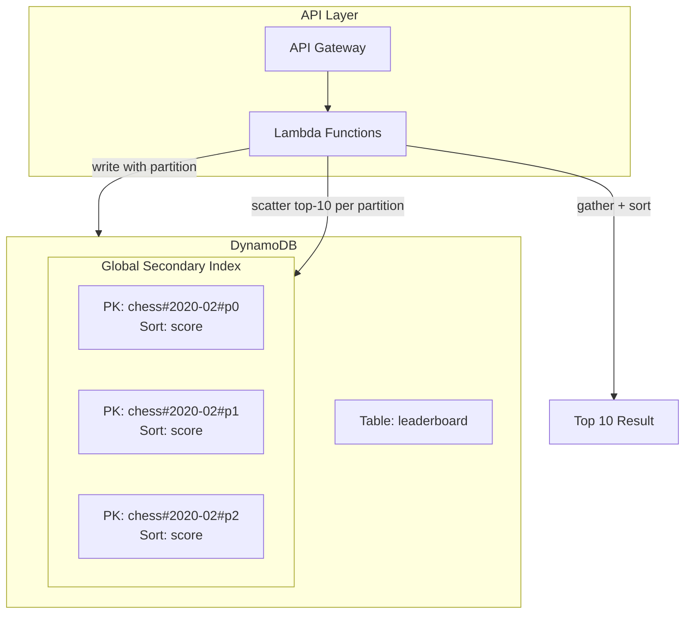

## Summary

DynamoDB offers a fully managed NoSQL alternative to Redis for leaderboards. A global secondary index (GSI) uses `game_name#year-month#partition_number` as the partition key and `score` as the sort key, providing locally sorted data within each partition. **Write sharding** appends `user_id % n` to the partition key to avoid hot partitions. Top-K queries use scatter-gather across all n partitions. Exact rank is impractical at scale, but percentile-based ranking (e.g., "you are in the top 10-20%") is achievable via periodic cron-based score distribution analysis.

## How It Works

### Write Sharding Pattern

1. **Problem**: All entries for `chess#2020-02` go to one partition, creating a hot partition
2. **Solution**: Append a partition number derived from the user: `chess#2020-02#p{user_id % n}`
3. Data is spread across n partitions, each locally sorted by score
4. Write throughput scales linearly with the number of partitions

### Scatter-Gather for Top-K

1. Query each of the n partitions for its local top 10
2. Gather all n x 10 results in the application layer
3. Sort and return the global top 10
4. Queries to different partitions can run in parallel to reduce latency

### Percentile Ranking

- Exact rank requires knowing every user's position across all partitions -- too expensive
- Instead, a **cron job** periodically analyzes score distributions per partition
- Builds a percentile table: `10th percentile = score < 100`, `90th percentile = score < 6500`
- Given a user's score, quickly return their approximate percentile (e.g., "top 10-20%")

| Aspect | DynamoDB Approach | Redis Approach |
|---|---|---|
| Management | Fully managed (no servers) | Self-managed or ElastiCache |
| Exact rank | Not feasible at scale | O(log n) via ZREVRANK |
| Top-K | Scatter-gather (n queries) | Single ZREVRANGE command |
| Write scaling | Add more partitions | Add more shards |
| Percentile rank | Yes, via cron analysis | Yes, but exact rank is also available |
| Cost model | Pay per request + storage | Pay per node (memory) |

## When to Use

- When you are already heavily invested in the AWS DynamoDB ecosystem
- When you prefer fully managed infrastructure with no Redis operations
- When approximate (percentile) ranking is acceptable instead of exact rank
- When write throughput at extreme scale (hundreds of millions of DAU) is critical

## Trade-offs

| Benefit | Cost |
|---------|------|
| Fully managed, no infrastructure ops | No exact rank at scale (only percentile) |
| Write sharding scales linearly | Top-K requires scatter-gather across all partitions |
| GSI provides local sorting within partitions | More partitions = higher scatter-gather latency |
| Pay-per-request pricing at low scale | Can become expensive at very high QPS |
| Single data store (no Redis + MySQL split) | Less real-time than Redis (DynamoDB latency is higher) |

## Real-World Examples

- **Amazon Games** -- DynamoDB-backed leaderboards for mobile games
- **Epic Games** -- DynamoDB used alongside Redis for various game services
- **Zynga** -- NoSQL leaderboards for social games
- **Supercell** -- Evaluates DynamoDB for backup/archive leaderboard data

## Common Pitfalls

- Not using write sharding (single partition becomes a hot spot immediately)
- Choosing too many partitions (scatter-gather latency increases with n)
- Choosing too few partitions (individual partitions hit DynamoDB throughput limits)
- Assuming DynamoDB provides exact rank via GSI (it only provides local sort order)
- Not running the percentile cron job frequently enough (stale percentile data)
- Forgetting that DynamoDB GSIs are eventually consistent by default

## See Also

- [[redis-sorted-sets]] -- The Redis alternative with exact ranking
- [[leaderboard-sharding]] -- Fixed vs hash partitioning in Redis
- [[leaderboard-architecture]] -- Overall system design for leaderboards
