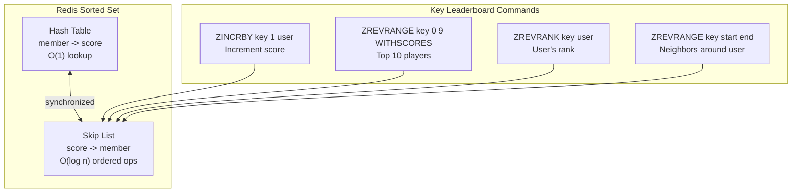

## Summary

A Redis sorted set is a collection of unique members, each associated with a floating-point score. Members are automatically maintained in ascending score order using two internal data structures: a **hash table** (O(1) member-to-score lookup) and a **skip list** (O(log n) score-ordered traversal). This combination provides O(log n) insert, update, rank, and range operations, making sorted sets the ideal data structure for real-time leaderboards with millions of members.

## How It Works

**Core operations for leaderboards:**

| Command | Purpose | Complexity | Example |
|---|---|---|---|
| ZADD | Insert member with score (or update) | O(log n) | `ZADD lb_feb 100 'alice'` |
| ZINCRBY | Increment member's score | O(log n) | `ZINCRBY lb_feb 1 'alice'` |
| ZREVRANGE | Fetch top K members (descending) | O(log n + k) | `ZREVRANGE lb_feb 0 9 WITHSCORES` |
| ZREVRANK | Get member's rank (descending) | O(log n) | `ZREVRANK lb_feb 'alice'` |
| ZRANGE | Fetch range (ascending) | O(log n + m) | `ZRANGE lb_feb 0 9` |

**Monthly leaderboard pattern:**
- Create a new sorted set per month: `leaderboard_feb_2021`, `leaderboard_mar_2021`
- Previous months are moved to historical/archival storage
- Each win calls `ZINCRBY` to add 1 point; if the user is new, score starts at 0

**Storage sizing:**
- 25M MAU with 24-byte user_id + 2-byte score = 650 MB raw
- With skip list and hash overhead (2x): around 1.3 GB
- Easily fits on a single modern Redis instance

## When to Use

- Real-time ranking of millions of entities by a numeric score
- When O(log n) rank/range queries are required (SQL cannot do this efficiently)
- Leaderboards, rate limiters, priority queues, and trending score systems
- When the dataset fits in memory (or can be sharded to fit)

## Trade-offs

| Benefit | Cost |
|---------|------|
| O(log n) for all key operations | In-memory only (more expensive per GB than disk) |
| Automatic ordering on insert/update | Requires persistence config (RDB/AOF) for durability |
| Simple command interface | Single-node memory limit requires sharding at extreme scale |
| Combined hash + skip list serves both lookup and range queries | Tie-breaking requires additional data structures (e.g., Redis Hash) |
| Battle-tested for leaderboard workloads | Not a relational database -- no JOIN or complex queries |

## Real-World Examples

- **Riot Games** -- Real-time ranked ladder using Redis sorted sets
- **Discord** -- Activity leaderboards for server members
- **Agora Games** -- Open-source leaderboard gem built on Redis sorted sets
- **AWS ElastiCache** -- Managed Redis service commonly used for gaming leaderboards
- **Stack Overflow** -- Reputation ranking system

## Common Pitfalls

- Letting clients update scores directly (always go through the game server for security)
- Not configuring Redis persistence (data loss on restart)
- Forgetting to handle ties (use a Redis Hash with timestamps for tie-breaking)
- Using ZRANGE instead of ZREVRANGE for descending leaderboards
- Not planning for monthly rotation (old sorted sets consuming memory)

## See Also

- [[skip-list]] -- The data structure powering sorted set performance
- [[leaderboard-architecture]] -- End-to-end system design using sorted sets
- [[sql-vs-redis-ranking]] -- Why SQL ORDER BY fails at leaderboard scale
