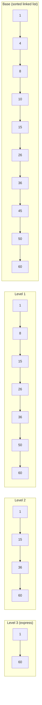

## Summary

A skip list is a probabilistic data structure that layers multiple levels of forward pointers on top of a sorted linked list. Each level skips roughly half the nodes of the level below, creating a hierarchy of express lanes. This yields O(log n) expected time for search, insert, and delete -- comparable to balanced binary search trees but simpler to implement and naturally suited to concurrent access. Redis uses skip lists internally for sorted sets, enabling O(log n) rank and range queries.

## How It Works

1. **Base level**: A standard sorted linked list containing all elements
2. **Index levels**: Each higher level contains approximately half the nodes from the level below
3. **Search**: Start at the highest level, move forward until the next node exceeds the target, then drop down one level and repeat
4. **Insert**: Determine the number of levels for the new node randomly (coin flip per level), then insert at each chosen level
5. **Delete**: Remove the node from all levels where it appears

**Example -- searching for 45 in a 10-element list:**
- Without skip list: traverse up to 8 nodes (linear scan)
- With 3 levels of indexes: traverse only 4-5 nodes

**Complexity:**

| Operation | Expected Time | Worst Case |
|---|---|---|
| Search | O(log n) | O(n) (extremely unlikely) |
| Insert | O(log n) | O(n) |
| Delete | O(log n) | O(n) |
| Space | O(n) | O(n log n) |

At scale, the improvement is dramatic: a 64-element list with 5 index levels needs only 11 node traversals instead of 62.

## When to Use

- When you need a sorted data structure with O(log n) operations and simpler implementation than balanced trees
- In concurrent/lock-free environments (skip lists are easier to make concurrent than red-black trees)
- As the backbone for in-memory ordered indexes (Redis sorted sets)
- When range queries over sorted data are a primary access pattern

## Trade-offs

| Benefit | Cost |
|---------|------|
| O(log n) search, insert, delete | Extra memory for index pointers (O(n) expected) |
| Simpler to implement than balanced BSTs | Probabilistic -- theoretical worst case is O(n) |
| Naturally supports range queries | Not as cache-friendly as arrays/B-trees for disk storage |
| Easy to make lock-free for concurrency | Randomized level assignment means non-deterministic structure |
| No rebalancing rotations needed | Slightly worse constant factors than optimized B-trees |

## Real-World Examples

- **Redis** -- Sorted sets use skip lists for score-ordered member storage
- **LevelDB / RocksDB** -- MemTable uses a skip list for in-memory sorted writes
- **Apache Lucene** -- Concurrent skip list for in-memory term dictionary
- **Java ConcurrentSkipListMap** -- Lock-free sorted map in the JDK

## Common Pitfalls

- Assuming skip lists are always better than balanced trees (B-trees are better for disk-based storage)
- Not randomizing level heights properly (deterministic heights defeat the probabilistic guarantees)
- Using skip lists for tiny datasets where a simple sorted array would suffice
- Forgetting that the O(log n) guarantee is expected, not worst-case (though worst case is vanishingly rare)

## See Also

- [[redis-sorted-sets]] -- How Redis uses skip lists for leaderboards
- [[sql-vs-redis-ranking]] -- Skip list performance vs SQL table scans
