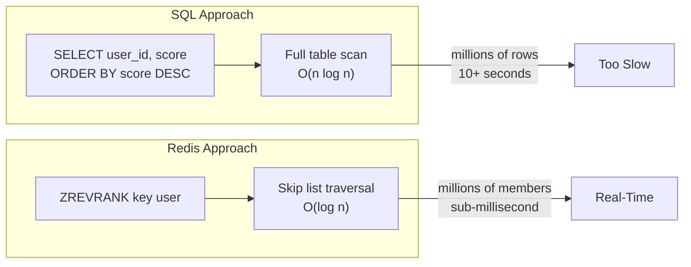

## Summary

SQL databases handle leaderboard ranking via `ORDER BY score DESC` with row numbering. This works at small scale but requires a full table scan -- O(n log n) -- for each rank query. With millions of continuously changing rows, queries take 10+ seconds, making SQL unsuitable for real-time leaderboards. Redis sorted sets provide O(log n) rank lookups, O(log n + m) range queries, and O(log n) score updates using skip lists. The trade-off: Redis is in-memory (higher cost per GB) and needs a persistence/recovery strategy, while SQL offers ACID guarantees and familiar tooling.

## How It Works



### SQL Ranking (small scale)

```sql
-- Insert or update score
INSERT INTO leaderboard (user_id, score) VALUES ('mary', 1);
UPDATE leaderboard SET score = score + 1 WHERE user_id = 'mary';

-- Get all ranks (full table scan)
SELECT (@rownum := @rownum + 1) AS rank, user_id, score
FROM leaderboard ORDER BY score DESC;

-- Get top 10 (index helps, but still limited)
SELECT user_id, score FROM leaderboard ORDER BY score DESC LIMIT 10;

-- Get specific user rank (nested query, O(n))
SELECT *, (SELECT COUNT(*) FROM leaderboard lb2
           WHERE lb2.score >= lb1.score) AS rank
FROM leaderboard lb1 WHERE lb1.user_id = 'mary';
```

**Problems at scale:**
- Ranking requires sorting ALL rows to determine any user's position
- Duplicate scores mean rank is not just array index
- Data changes constantly -- caching is not viable
- `LIMIT` helps for top-K but not for arbitrary user rank

### Redis Ranking (any scale)

```
ZINCRBY leaderboard_feb 1 'mary'        -- O(log n)
ZREVRANGE leaderboard_feb 0 9 WITHSCORES -- O(log n + 10)
ZREVRANK leaderboard_feb 'mary'          -- O(log n)
```

| Operation | SQL | Redis Sorted Set |
|---|---|---|
| Update score | O(log n) with index | O(log n) |
| Get user rank | O(n) -- table scan | O(log n) |
| Get top K | O(n log n) or O(K) with index | O(log n + K) |
| Handles ties | Yes (COUNT-based) | Yes (same rank for same score) |
| Real-time at 5M+ users | No (10+ second queries) | Yes (sub-millisecond) |

## When to Use

- **SQL**: Batch/offline leaderboards, small user bases (<100K), when ACID is required, when leaderboard is a secondary feature
- **Redis**: Real-time leaderboards, millions of users, when sub-second rank queries are required
- **Both**: Redis for real-time queries + MySQL for durability and disaster recovery

## Trade-offs

| Benefit | Cost |
|---------|------|
| SQL: ACID guarantees, familiar tooling | SQL: O(n) rank queries at scale |
| SQL: free durability on disk | SQL: not designed for high-frequency rank recalculation |
| Redis: O(log n) all operations | Redis: in-memory (expensive at large scale) |
| Redis: sub-millisecond responses | Redis: needs persistence config (RDB/AOF) |
| Redis: natural sorted-set semantics | Redis: disaster recovery requires MySQL replay |

## Real-World Examples

- **Early MMOs** -- SQL-based leaderboards that struggled at scale
- **Mobile games (2010s)** -- Transition from SQL to Redis as player counts grew
- **Stack Overflow** -- Uses SQL for reputation but with heavy caching
- **Riot Games / Supercell** -- Redis sorted sets for real-time competitive ladders

## Common Pitfalls

- Assuming SQL indexes solve the ranking problem (indexes help top-K but not arbitrary rank)
- Using SQL for real-time rank with millions of rows (guaranteed timeout)
- Using only Redis without a durable backup (data loss on catastrophic failure)
- Not testing rank query latency under load with realistic data volumes
- Caching SQL rank results (data changes too fast for cache to be useful)

## See Also

- [[redis-sorted-sets]] -- How Redis sorted sets work internally
- [[skip-list]] -- The data structure behind O(log n) performance
- [[leaderboard-architecture]] -- Full system design combining Redis and MySQL
