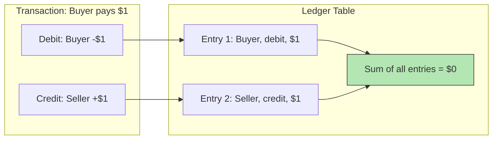

## Summary

The double-entry ledger is a fundamental accounting principle applied to payment systems. Every transaction is recorded as two entries: a **debit** from one account and a **credit** to another, for the same amount. The sum of all transaction entries must always be zero. This provides end-to-end traceability and ensures consistency throughout the payment cycle. Amounts are stored as strings (not doubles) to avoid floating-point precision errors during serialization and deserialization across different protocols and systems.

## How It Works

### Double-Entry Rules

| Rule | Description |
|---|---|
| Every transaction has two entries | One debit and one credit |
| Entries must balance | Debit amount = credit amount |
| Sum invariant | Sum of all entries across all accounts = 0 |
| Immutability | Entries are append-only; corrections are new entries |

### Example: Buyer Purchases from Seller

| Account | Type | Amount |
|---|---|---|
| Buyer | Debit | $1.00 |
| Seller | Credit | $1.00 |
| **Net** | | **$0.00** |

### Why Strings for Amounts?

1. **Precision across protocols:** Different serialization formats handle floating-point precision differently
2. **Extreme ranges:** Japan's GDP (~5x10^14 yen) and Bitcoin satoshi (10^-8) both need exact representation
3. **Rule:** Store as strings during transmission and storage; parse to numbers only for display or calculation

## When to Use

- Any financial system that must provide traceability and auditability
- Payment systems where regulatory compliance requires accounting records
- When you need to detect discrepancies (if entries do not sum to zero, something is wrong)
- Post-payment analysis: revenue calculation, forecasting, tax reporting

## Trade-offs

| Benefit | Cost |
|---|---|
| Complete traceability of every cent | Double the ledger entries (2 per transaction) |
| Sum-to-zero invariant catches errors | More complex write path |
| Immutable append-only design | Cannot "fix" entries -- must add correction entries |
| Standard accounting practice (well understood) | Requires careful handling of multi-currency |
| Enables reconciliation with external systems | Storage grows linearly with transactions |

## Real-World Examples

- **Square Books** -- Immutable double-entry accounting database service
- **Stripe** -- Internal ledger using double-entry for all money movement
- **QuickBooks** -- Double-entry bookkeeping for small businesses
- **SAP** -- Enterprise-grade general ledger based on double-entry
- **Modern payment processors** -- All use double-entry internally for regulatory compliance

## Common Pitfalls

- Using floating-point (double) for monetary amounts -- precision loss accumulates over millions of transactions
- Allowing mutable ledger entries -- corrections must be new entries, not updates to existing ones
- Not enforcing the sum-to-zero invariant at the database level -- bugs can create or destroy money
- Forgetting to record both sides of a transaction during error handling paths
- Not separating the ledger from the wallet -- the ledger records history; the wallet tracks current balance

## See Also

- [[payment-system-architecture]] -- Where the ledger fits in the payment flow
- [[reconciliation]] -- Uses the ledger as the source of truth for comparison
- [[payment-consistency]] -- Ensuring ledger and wallet stay in sync
