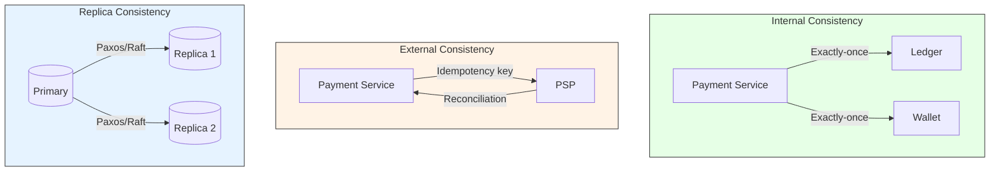

## Summary

Multiple stateful services in a payment system -- the payment service, ledger, wallet, PSP, and database replicas -- must remain consistent in a distributed environment. Internal consistency relies on exactly-once processing. External consistency with PSPs uses idempotency keys plus reconciliation. Replica consistency uses consensus algorithms (Paxos, Raft) or consensus-based databases (YugabyteDB, CockroachDB). Synchronous communication creates tight coupling and degrades performance; asynchronous communication via Kafka enables fan-out to analytics, billing, and notifications while improving failure isolation.

## How It Works

### Communication Patterns

| Pattern | Description | Best For |
|---|---|---|
| Synchronous (HTTP) | Direct request-response | Simple systems; low scale |
| Async - Single receiver | Message queue; one consumer per message | Task distribution |
| Async - Multiple receivers (Kafka) | Topic-based; multiple consumers per message | Fan-out: analytics, billing, notifications |

### Replica Consistency Options

| Approach | Pro | Con |
|---|---|---|
| Primary-only reads/writes | Simple setup | Replicas waste resources; no read scaling |
| Consensus algorithms (Paxos/Raft) | Strong consistency; fault-tolerant | Implementation complexity; write overhead |
| Consensus-based DBs (YugabyteDB, CockroachDB) | Built-in distributed consistency | Vendor lock-in; operational learning curve |

## When to Use

- Any distributed payment system with multiple stateful services
- When external PSPs may return different results than internal records
- When database replicas must serve consistent reads
- When multiple downstream services need to react to the same payment event

## Trade-offs

| Benefit | Cost |
|---|---|
| Kafka fan-out enables decoupled services | Eventual consistency; harder to debug |
| Idempotency + reconciliation covers external drift | Must implement both mechanisms |
| Consensus algorithms ensure replica consistency | Write latency increases with replication |
| Async communication improves failure isolation | Messages may be delayed or reordered |
| Multiple consistency mechanisms overlap | More infrastructure to maintain |

## Real-World Examples

- **Uber** -- Kafka-based payment pipeline with multiple consumers (payment, analytics, billing)
- **Stripe** -- Idempotency keys for all API calls; nightly reconciliation with banks
- **CockroachDB** -- Used by financial services for built-in distributed ACID transactions
- **Amazon** -- Multi-region replicated payment databases with consensus
- **Netflix** -- Eventual consistency patterns for billing and subscription management

## Common Pitfalls

- Relying on synchronous communication at scale -- creates cascading failures when any service slows down
- Assuming external PSPs are always correct -- always reconcile, even if the PSP supports idempotency
- Using async-only without reconciliation -- messages can be lost; reconciliation is the safety net
- Not handling replication lag -- reads from replicas may return stale payment status
- Mixing strong and eventual consistency without clear boundaries -- leads to subtle bugs

## See Also

- [[retry-and-idempotency]] -- Exactly-once delivery for internal consistency
- [[reconciliation]] -- Last line of defense for external consistency
- [[payment-system-architecture]] -- The services that need to stay consistent
