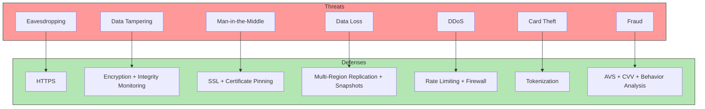

## Summary

Payment systems must defend against a wide range of security threats. The defense strategy combines encryption (HTTPS), integrity monitoring, certificate pinning (SSL), multi-region replication for data loss prevention, rate limiting and firewalls for DDoS protection, tokenization to avoid storing real card numbers, PCI DSS compliance for organizations handling branded credit cards, and fraud detection through address verification, CVV checks, and user behavior analysis. The hosted payment page approach (where the PSP collects card data) is itself a security measure that eliminates the need for the merchant to handle sensitive card information.

## How It Works

### Threat-Defense Matrix

| Threat | Defense | Description |
|---|---|---|
| Request/response eavesdropping | HTTPS | Encrypts all data in transit |
| Data tampering | Encryption + integrity monitoring | Detects unauthorized modifications |
| Man-in-the-middle attack | SSL with certificate pinning | Prevents fake certificate attacks |
| Data loss | Multi-region replication + snapshots | Redundant copies across data centers |
| DDoS attack | Rate limiting + firewall | Throttles abusive traffic |
| Card theft | Tokenization | Stores tokens instead of real card numbers |
| PCI compliance | PCI DSS standards | Information security standard for card handlers |
| Fraud | AVS, CVV, behavior analysis | Multi-signal fraud detection |

### Tokenization Flow

1. User enters card details on the PSP's hosted payment page
2. PSP stores the actual card number and returns a token
3. The payment system only ever sees and stores the token
4. For subsequent charges, the token is sent to the PSP, which maps it back to the real card

## When to Use

- Every payment system -- security is not optional
- When accepting credit card payments (PCI DSS compliance required)
- When operating in multiple regions (different regulatory requirements)
- When processing high volumes (DDoS protection becomes critical)

## Trade-offs

| Benefit | Cost |
|---|---|
| HTTPS is standard and well-supported | TLS handshake adds latency |
| Tokenization eliminates card storage risk | Dependency on PSP for token management |
| Rate limiting prevents abuse | May block legitimate burst traffic |
| Multi-region replication prevents data loss | Cross-region sync adds complexity and cost |
| Behavior analysis catches sophisticated fraud | False positives block legitimate users |

## Real-World Examples

- **Stripe** -- Tokenization via Stripe.js; PCI DSS Level 1 certified
- **Apple Pay** -- Device-specific tokenization; biometric authentication
- **Cloudflare** -- DDoS protection for payment endpoints
- **3D Secure (Visa/Mastercard)** -- Extra authentication step for online card payments
- **Uber** -- ML-based fraud detection analyzing ride patterns and payment behavior

## Common Pitfalls

- Storing raw card numbers in your database -- PCI DSS compliance is extremely expensive to maintain
- Not implementing rate limiting on payment endpoints -- a DDoS attack can take down the entire payment flow
- Using self-signed certificates -- makes man-in-the-middle attacks trivial
- Not monitoring for anomalous payment patterns -- fraud detection must be proactive, not reactive
- Treating security as a one-time setup -- threats evolve; security must be continuously updated

## See Also

- [[psp-integration]] -- Hosted payment pages as a security measure
- [[payment-system-architecture]] -- Where security controls are applied in the flow
- [[payment-consistency]] -- Security and consistency are complementary concerns
