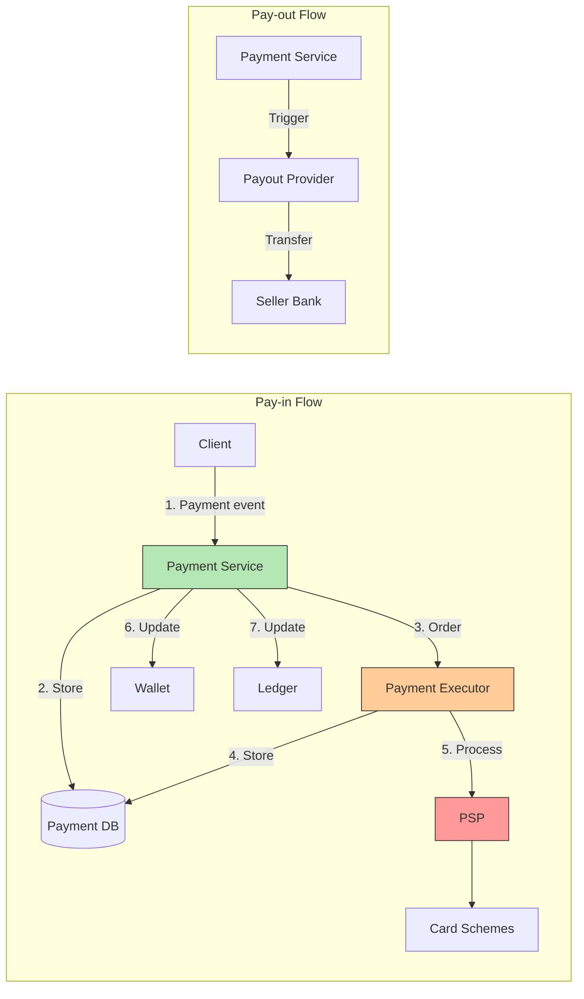

## Summary

An e-commerce payment backend separates money flow into two distinct paths: the **pay-in flow** (buyer pays the platform via PSP and credit card) and the **pay-out flow** (platform pays sellers via third-party payout providers). The payment service orchestrates events through a payment executor, PSP, ledger, and wallet. A single payment event (checkout) may spawn multiple payment orders (one per seller). Each order is tracked through the states NOT_STARTED, EXECUTING, SUCCESS, and FAILED. A relational database with ACID guarantees is preferred over NoSQL for proven stability, tooling maturity, and DBA availability.

## How It Works

1. User clicks "place order" -- a payment event is sent to the payment service
2. The payment service stores the event and creates payment orders (one per seller)
3. The payment executor sends each order to the PSP for processing
4. On success, the wallet records the seller's balance and the ledger records the double-entry transaction
5. Pay-out is triggered separately (e.g., on product delivery) via a third-party payout provider

### Payment Order States

| State | Meaning |
|---|---|
| NOT_STARTED | Order created, not yet sent to executor |
| EXECUTING | Sent to PSP, awaiting response |
| SUCCESS | PSP confirmed payment processed |
| FAILED | PSP returned failure or timeout exceeded |

## When to Use

- Building an e-commerce payment backend (Amazon, Shopify, etc.)
- When you need to orchestrate multiple third-party payment providers
- When auditability and financial traceability are critical requirements
- When reliability matters more than raw throughput (10 TPS is fine for 1M transactions/day)

## Trade-offs

| Benefit | Cost |
|---|---|
| Separate pay-in/pay-out simplifies each flow | Two distinct systems to build and maintain |
| Relational DB provides ACID guarantees | Lower write throughput vs NoSQL |
| Payment executor abstracts PSP differences | Additional service hop adds latency |
| Multiple payment orders per event | Complexity in tracking partial completions |
| Wallet + Ledger separation | Must keep both consistent (reconciliation needed) |

## Real-World Examples

- **Stripe** -- Full-stack PSP providing APIs for pay-in, pay-out, and ledger
- **Amazon Pay** -- Multi-seller checkout with per-seller payment orders
- **PayPal** -- Payment service orchestrating across card schemes and bank transfers
- **Uber** -- Kafka-based payment pipeline handling millions of daily rides
- **Airbnb** -- Separate pay-in (guest) and pay-out (host) flows with delayed settlement

## Common Pitfalls

- Using NoSQL for the payment database -- losing ACID guarantees creates reconciliation nightmares
- Not separating payment events from payment orders -- a single checkout may involve multiple sellers
- Treating pay-in and pay-out as one flow -- they have different timing, providers, and regulatory requirements
- Ignoring the wallet/ledger update step after PSP success -- leads to inconsistent financial records
- Choosing a PSP without webhook support -- makes async status tracking much harder

## See Also

- [[psp-integration]] -- How hosted payment pages and token-based flows work
- [[double-entry-ledger]] -- The accounting principle behind the ledger
- [[reconciliation]] -- Nightly settlement file comparison
- [[payment-consistency]] -- Keeping all services in sync
