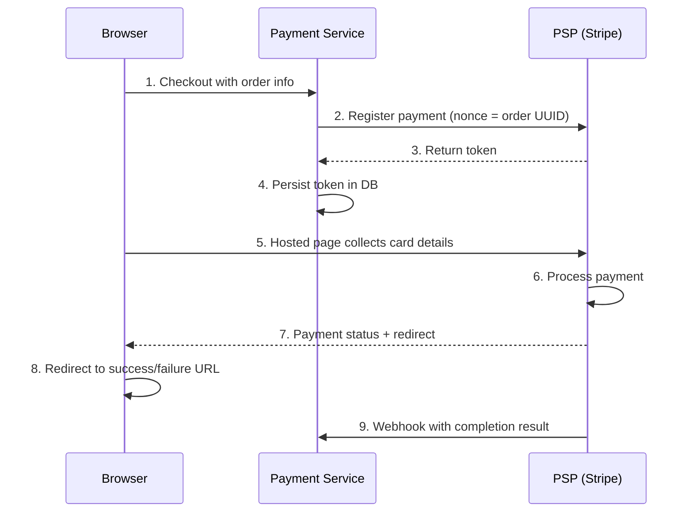

## Summary

Most companies integrate with a Payment Service Provider (PSP) like Stripe or Adyen rather than connecting directly to banks or card schemes. The **hosted payment page** approach is preferred because it avoids storing credit card data internally, eliminating the need for PCI DSS compliance. The flow uses a nonce-based registration, a PSP-issued token, and a hosted page (iframe or SDK) that collects card details directly from the user. A webhook delivers the asynchronous completion result. The token uniquely maps to the payment order, serving as the PSP-side idempotency key.

## How It Works

1. **Registration:** Payment service sends order details and a nonce (payment_order_id) to the PSP
2. **Token exchange:** PSP returns a token that uniquely maps to the nonce (and thus the payment order)
3. **Hosted page:** Client displays the PSP's payment UI (iframe/SDK); card data goes directly to PSP
4. **Processing:** PSP processes payment via card schemes; user sees result on redirect page
5. **Webhook:** PSP asynchronously notifies payment service of the final status

### Two Integration Approaches

| Approach | When to Use |
|---|---|
| **Hosted payment page** | Most companies -- avoids storing card data and PCI DSS burden |
| **Direct API integration** | Large companies that can justify PCI DSS compliance investment |

## When to Use

- When building payment flows for web or mobile applications
- When you want to avoid PCI DSS compliance requirements (most cases)
- When you need multiple PSP support (each PSP provides its own hosted page)
- When handling long-running payments (3D Secure authentication, manual review)

## Trade-offs

| Benefit | Cost |
|---|---|
| No card data touches your system | Less control over payment UI/UX |
| PCI DSS compliance offloaded to PSP | Redirect latency for web flows |
| Token-based idempotency built in | Dependency on PSP availability |
| Webhook for async status updates | Must handle webhook failures/retries |
| SDK support for mobile apps | SDK versioning and maintenance |

## Real-World Examples

- **Stripe Elements** -- JavaScript library embedding payment fields in your page
- **PayPal Checkout** -- Hosted modal/redirect for PayPal and card payments
- **Adyen Drop-in** -- Pre-built UI component supporting 30+ payment methods
- **Braintree Hosted Fields** -- Iframe-based card fields for PCI SAQ A compliance
- **Square Web Payments SDK** -- Tokenization of card data before it reaches your server

## Common Pitfalls

- Storing the PSP token without persisting it to the database before showing the hosted page -- if the server crashes, you lose the token-to-order mapping
- Not implementing webhook handlers -- relying solely on redirect URL for payment status is unreliable
- Confusing nonce and token -- the nonce is your payment_order_id sent to PSP; the token is what PSP returns
- Not handling 3D Secure or manual review delays -- some payments take hours or days; the UI must reflect pending status
- Ignoring webhook signature verification -- without it, anyone can forge payment completion notifications

## See Also

- [[payment-system-architecture]] -- Where PSP integration fits in the overall flow
- [[retry-and-idempotency]] -- How the token serves as the PSP-side idempotency key
- [[payment-security]] -- Tokenization and PCI DSS compliance details
