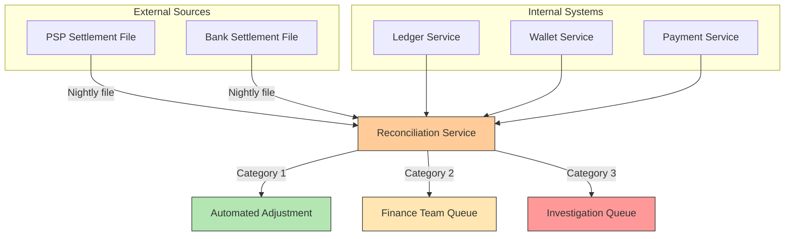

## Summary

Reconciliation is the **last line of defense** in a payment system. It is a periodic process that compares the states among related services to verify they are in agreement. Every night, PSPs and banks send settlement files containing transaction details and account balances. The reconciliation system parses these files and compares them against the internal ledger. Reconciliation is also used internally to verify consistency between the ledger, wallet, and payment service. Mismatches fall into three categories based on their classifiability and fixability.

## How It Works

### Three Mismatch Categories

| Category | Description | Resolution |
|---|---|---|
| 1. Classifiable + Automatable | Known cause; cost-effective to code a fix | Automated program adjusts records |
| 2. Classifiable + Manual | Known cause; fix is too expensive to automate | Finance team fixes via job queue |
| 3. Unclassifiable | Unknown cause; requires investigation | Finance team investigates manually |

### Reconciliation Flow

1. PSP/bank sends nightly settlement file with all transactions and final balance
2. Reconciliation service parses the file and loads internal ledger records for the same period
3. Transaction-by-transaction comparison identifies mismatches
4. Each mismatch is classified and routed to the appropriate resolution queue
5. Internal reconciliation separately compares ledger vs wallet vs payment service records

## When to Use

- Any payment system that interacts with external financial services
- When async communication creates eventual consistency between internal and external systems
- When you need a provable audit trail for financial regulators
- As a complement to idempotency and retry mechanisms (catches what they miss)

## Trade-offs

| Benefit | Cost |
|---|---|
| Catches all inconsistencies eventually | Up to 24-hour delay in detection |
| Works regardless of communication pattern | Requires settlement file parsing per PSP |
| Provides financial audit trail | Manual investigation for unclassifiable mismatches |
| Automated fixes reduce human workload | Must maintain classification rules |
| Independent of internal system complexity | Additional batch infrastructure to maintain |

## Real-World Examples

- **Stripe** -- Provides detailed settlement reports and reconciliation APIs for merchants
- **Amazon** -- Multi-PSP reconciliation across global payment methods
- **Uber** -- Reconciles ride payments across drivers, riders, and multiple PSPs nightly
- **Airbnb** -- Cross-currency reconciliation for international bookings
- **Banks** -- End-of-day reconciliation between core banking and card processing systems

## Common Pitfalls

- Skipping reconciliation because "idempotency handles everything" -- external systems can still diverge
- Not classifying mismatches -- treating all mismatches as manual work overwhelms the finance team
- Running reconciliation too infrequently -- daily is the minimum; some high-volume systems run hourly
- Ignoring internal reconciliation -- ledger and wallet can diverge even without external issues
- Not alerting on reconciliation failures -- if the reconciliation job itself fails, nobody knows about mismatches

## See Also

- [[double-entry-ledger]] -- The internal ledger that reconciliation verifies
- [[payment-consistency]] -- Other consistency mechanisms complementing reconciliation
- [[payment-system-architecture]] -- Where reconciliation fits in the overall system
