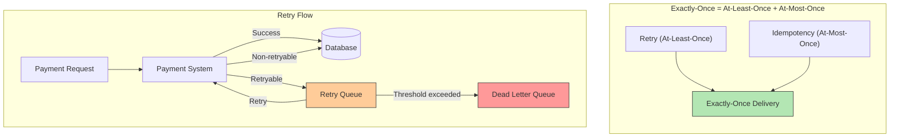

## Summary

Exactly-once payment execution is achieved by combining **at-least-once** (retry) with **at-most-once** (idempotency). Retry strategies range from immediate to exponential backoff. Idempotency uses a unique key (UUID) per payment order -- the database primary key serves as the idempotency key, and duplicate inserts are rejected by the unique constraint. Failed payments route through a retry queue and eventually to a dead letter queue after exceeding the retry threshold. On the PSP side, the token serves as the idempotency key, ensuring duplicate requests return the previous result rather than charging again.

## How It Works

### Retry Strategies

| Strategy | Description | Best For |
|---|---|---|
| Immediate | Resend right away | Transient glitches |
| Fixed interval | Constant wait between retries | Known recovery time |
| Incremental | Linearly increasing wait | Gradual recovery |
| Exponential backoff | Double wait each time (1s, 2s, 4s, 8s...) | Unknown recovery time |
| Cancel | Abort the request | Permanent failures |

### Idempotency Mechanism

1. Client generates a UUID as the idempotency key (often `payment_order_id`)
2. Payment system attempts INSERT with this UUID as the primary key
3. If INSERT succeeds: new request -- process it
4. If INSERT fails (duplicate key): previously seen -- return cached result
5. Concurrent duplicates receive HTTP 429 Too Many Requests

### PSP-Side Idempotency

The nonce (payment_order_id) sent during registration maps to the PSP-issued token. If the user clicks "pay" again, the same token is sent to the PSP, which recognizes it and returns the previous execution result.

## When to Use

- Any distributed system where operations must not be duplicated (payments, order creation)
- When network failures can cause ambiguous responses (did the payment succeed or not?)
- When users may double-click submit buttons
- When webhook delivery may fail and require re-delivery

## Trade-offs

| Benefit | Cost |
|---|---|
| Prevents double charges (critical for trust) | Requires globally unique IDs per operation |
| Self-healing via retry | Aggressive retries can overload downstream services |
| Dead letter queue isolates problem payments | DLQ requires monitoring and manual investigation |
| Simple DB-based idempotency | Must store every request for deduplication |
| Exponential backoff prevents thundering herd | Slow recovery for individual requests |

## Real-World Examples

- **Stripe** -- Idempotency-Key header on all mutation endpoints; returns cached response for duplicates
- **PayPal** -- PayPal-Request-Id header for idempotent API calls
- **Uber** -- Kafka-based retry and dead letter queues for payment processing
- **AWS SQS** -- Built-in dead letter queue for messages exceeding max receive count
- **Google Pay** -- Unique transaction IDs for deduplication across retries

## Common Pitfalls

- Using non-unique values as idempotency keys (e.g., user_id instead of order_id)
- Retrying non-retryable errors (e.g., invalid card number) -- wastes resources and never succeeds
- Not capping retry count -- infinite retries can create cascading failures
- Generating a new idempotency key on retry -- defeats the purpose; must reuse the same key
- Not monitoring the dead letter queue -- failed payments sit unresolved indefinitely

## See Also

- [[payment-system-architecture]] -- Where retry and idempotency fit in the payment flow
- [[psp-integration]] -- How the token serves as the PSP-side idempotency key
- [[payment-consistency]] -- Idempotency as one tool in the consistency toolkit
