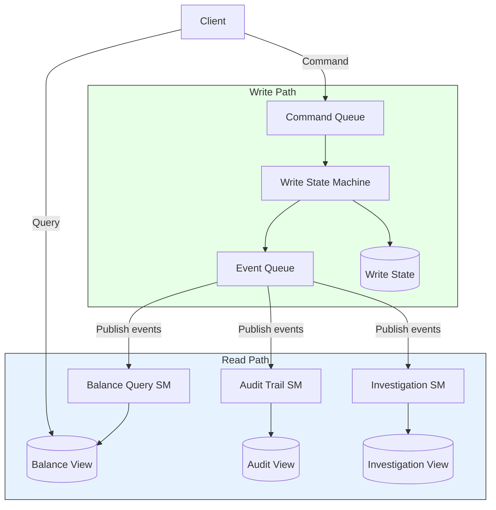
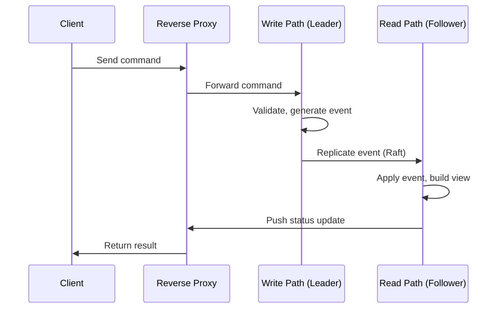

## Summary

CQRS separates the **write path** (one state machine that validates commands and applies events) from the **read path** (multiple read-only state machines that build query-optimized views from the event stream). Rather than publishing state directly, event sourcing publishes events, and the external world rebuilds any customized state representation it needs. Each read-only state machine can derive different views: balance queries, audit trails, time-range investigations, or analytics. The read path is eventually consistent but always catches up. Combined with a reverse proxy, CQRS can provide synchronous-feeling responses by pushing status updates in real time.

## How It Works

### Write vs Read Path

| Aspect | Write Path | Read Path |
|---|---|---|
| Count | Exactly one state machine | Multiple state machines |
| Responsibility | Validate commands, generate/apply events | Build query-optimized views |
| Data source | Command queue | Published event stream |
| Consistency | Strongly consistent (single writer) | Eventually consistent (lag behind) |
| Customization | Fixed logic | Each SM can build different views |

### Push Model with Reverse Proxy

To avoid polling, a reverse proxy sits between the client and the event sourcing nodes. The read-only state machine pushes execution status to the reverse proxy as soon as it processes the event, giving users a real-time response.

## When to Use

- When read and write workloads have different scaling requirements
- When multiple consumers need different views of the same data
- When the write model is event-sourced and reads need materialized views
- When you need both real-time balance queries and historical audit trails
- Financial systems where auditability and performance must coexist

## Trade-offs

| Benefit | Cost |
|---|---|
| Multiple independent read views | Each view requires its own state machine and storage |
| Read and write scale independently | Eventual consistency between write and read paths |
| Each read SM can optimize for its query pattern | More moving parts to operate and monitor |
| Natural fit with event sourcing | Stale reads possible during lag |
| Supports real-time via push model | Reverse proxy adds architectural complexity |

## Real-World Examples

- **Digital wallets** -- Write path processes transfers; read path serves balance and transaction history queries
- **E-commerce** -- Write path handles orders; read paths for inventory views, analytics, and search
- **Banking** -- Write path for transactions; read paths for account statements, fraud detection, and reporting
- **Martin Fowler's CQRS** -- Canonical description at martinfowler.com/bliki/CQRS.html
- **Axon Framework** -- Java framework providing built-in CQRS support with event sourcing

## Common Pitfalls

- Expecting read views to be immediately consistent -- they lag behind; design the UI accordingly
- Building only one read view -- the power of CQRS is in multiple specialized views
- Not monitoring read path lag -- if a read SM falls behind, users see stale data indefinitely
- Overcomplicating the write path with query logic -- keep the write path focused on command validation and event generation
- Using CQRS without event sourcing -- possible, but loses reproducibility and audit benefits

## See Also

- [[event-sourcing]] -- The immutable event log that CQRS reads from
- [[event-sourcing]] -- CQRS in the full distributed wallet design
- [[event-sourcing]] -- Audit views built by read-only state machines
