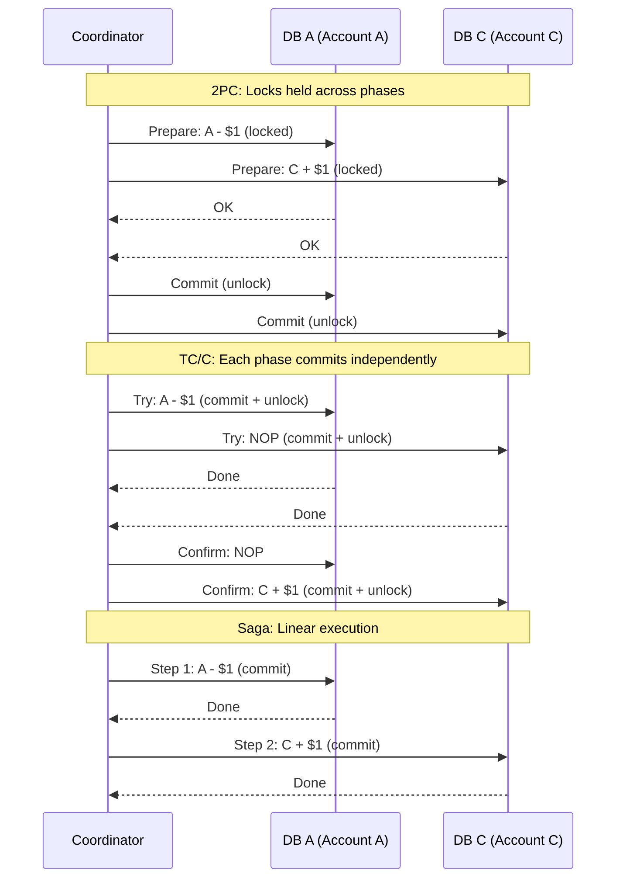

## Summary

Three approaches to making multi-node operations atomic in a distributed digital wallet. **2PC (two-phase commit)** uses database-level prepare/commit phases with locks held across both -- simple but slow with a coordinator single point of failure. **TC/C (Try-Confirm/Cancel)** is application-level: the Try phase deducts money and commits immediately, then Confirm adds to the recipient (or Cancel reverses the deduction). Each phase is a separate transaction, enabling parallel execution but causing temporary balance imbalance. **Saga** executes operations in strict linear order with compensating rollbacks. All three require a **phase status table** for crash recovery and out-of-order handling.

## How It Works

### Comparison

| Feature | 2PC | TC/C | Saga |
|---|---|---|---|
| Lock duration | Long (across both phases) | Short (per phase) | Short (per step) |
| Phase relationship | Same transaction | Separate transactions | Separate transactions |
| Execution order | Any | Any (parallel possible) | Strictly linear |
| Rollback | DB-level abort | App-level compensation | App-level compensation |
| Coordinator SPOF | Yes (locks stuck if coordinator dies) | Mitigated by phase status table | Mitigated by phase status table |
| Performance | Slow | Faster (parallelism) | Medium (sequential) |
| Implementation | Database level (XA) | Application level | Application level |

### TC/C: Valid Operation Order

Only **deduct-first** is safe:

| Choice | Try on A | Try on C | Why |
|---|---|---|---|
| Choice 1 (valid) | -$1 | NOP | Safe: if Cancel needed, just reverse A |
| Choice 2 (invalid) | NOP | +$1 | Dangerous: someone may spend C's $1 before Cancel |
| Choice 3 (invalid) | -$1 | +$1 | Complex: hard to handle partial failures |

### Out-of-Order Execution

Network delays may cause Cancel to arrive before Try at a node:
1. Cancel sets an **out-of-order flag** in the database
2. When Try arrives later, it checks for the flag and returns failure
3. This prevents executing a Try that should have been cancelled

### Phase Status Table

Stored alongside the deducting account's database:
- Distributed transaction ID and content
- Try phase status per database (not sent / sent / response received)
- Second phase name (Confirm or Cancel)
- Second phase status
- Out-of-order flag

## When to Use

- When a single operation must update data across multiple database partitions
- **2PC:** Simple cases with few participants and low latency requirements
- **TC/C:** Latency-sensitive systems with many services (parallel execution)
- **Saga:** Microservice architecture (de-facto standard); fewer services

## Trade-offs

| Benefit | Cost |
|---|---|
| 2PC is conceptually simple | Long-held locks degrade performance |
| TC/C allows parallel execution | Complex compensation logic in application |
| Saga is the microservice standard | Strictly sequential execution |
| Phase status table enables crash recovery | Additional storage and bookkeeping |
| TC/C and Saga are database-agnostic | Must implement undo logic manually |

## Real-World Examples

- **Digital wallets (PayPal, Venmo)** -- TC/C or Saga for cross-account transfers
- **X/Open XA** -- Industry standard for 2PC across heterogeneous databases
- **Axon Framework** -- Saga implementation for Java microservices
- **Temporal** -- Workflow engine commonly used for Saga orchestration
- **AWS Step Functions** -- Saga pattern with compensating transactions for serverless

## Common Pitfalls

- Using 2PC when TC/C would work -- unnecessary lock contention degrades throughput
- Crediting before debiting in TC/C -- creates a window where money can be spent before reversal
- Not implementing the phase status table -- coordinator crash leaves transactions in limbo
- Ignoring out-of-order execution -- network delays can deliver Cancel before Try
- Not testing compensation (rollback) paths -- only testing the happy path leaves bugs in error handling

## See Also

- [[event-sourcing]] -- The architecture that distributed transactions coordinate within
- [[event-sourcing]] -- How Saga coordinates across partitioned event sourcing groups
- [[raft-consensus]] -- Replication within each partition that distributed transactions span
