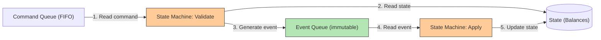

## Summary

Event sourcing is a design philosophy where all changes to application state are stored as an immutable, append-only sequence of **events** rather than as mutable state. Commands enter a FIFO queue, are validated by a deterministic state machine, and converted into events. Events are then applied to update state (e.g., account balances). Because the event list is immutable and the state machine is deterministic, any historical state can be **reproduced exactly** by replaying events from the beginning. This makes event sourcing the de-facto solution for financial systems like digital wallets that require full auditability and correctness verification.

## How It Works

### Four Key Terms

| Term | Definition | Example |
|---|---|---|
| **Command** | Intended action from outside world | "Transfer $1 from A to C" |
| **Event** | Validated, immutable historical fact | "Transferred $1 from A to C" |
| **State** | Current data (what changes when events are applied) | Account A: $4, Account C: $6 |
| **State machine** | Deterministic processor (no randomness, no I/O) | Validates command, generates and applies events |

### Command vs Event

| Property | Command | Event |
|---|---|---|
| Validity | May be invalid (insufficient balance) | Always valid -- represents a fact |
| Tense | Present/imperative ("transfer $1") | Past tense ("transferred $1") |
| Determinism | May contain randomness or I/O | Must be deterministic |
| Cardinality | One command generates 0+ events | Each event is applied exactly once |

### Reproducibility

1. Start from initial state (all balances = 0)
2. Replay every event in order through the deterministic state machine
3. Result is guaranteed identical every time
4. Can stop at any point to get the historical state at that moment

## When to Use

- Financial systems requiring audit trails (wallets, ledgers, banking)
- Systems where regulators may ask "what was the balance at time X?"
- When you need to prove correctness after code changes (replay with old and new code)
- When you need to reconstruct historical state for debugging or analysis
- Systems where the event log is more valuable than the current state

## Trade-offs

| Benefit | Cost |
|---|---|
| Full auditability and reproducibility | Significantly more storage for event log |
| Can verify correctness by replaying | Replay can be slow without snapshots |
| Decouples write (events) from read (state) | More complex architecture than CRUD |
| Historical state available at any point in time | Event schema evolution is challenging |
| Natural fit for CQRS pattern | Eventually consistent reads |

## Real-World Examples

- **Digital wallets (PayPal, Venmo)** -- Event-sourced balance tracking for auditability
- **Banking core systems** -- Immutable transaction logs as the source of truth
- **Event Store DB** -- Purpose-built database for event sourcing
- **Apache Kafka** -- Often used as the event/command store
- **Axon Framework** -- Java framework for event sourcing and CQRS
- **Datomic** -- Immutable database that stores all historical states

## Common Pitfalls

- Allowing the state machine to contain randomness or external I/O -- breaks reproducibility guarantee
- Not distinguishing between commands and events -- commands may be invalid; events are facts
- Storing state but not events -- lose the ability to replay and audit
- Not handling event schema evolution -- old events must remain readable as the schema changes
- Replaying from the beginning every time -- use snapshots to checkpoint state periodically

## See Also

- [[cqrs]] -- Read/write path separation built on event sourcing
- [[event-sourcing]] -- How event sourcing enables compliance verification
- [[high-performance-event-sourcing]] -- File-based optimizations for event sourcing
- [[event-sourcing]] -- The full distributed architecture using event sourcing
