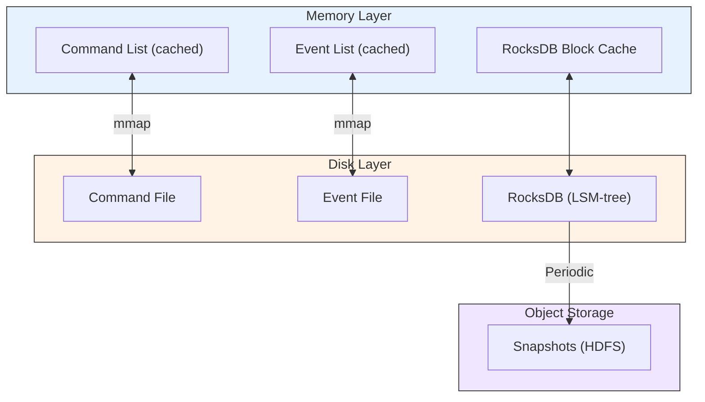

## Summary

Three key optimizations transform remote-store event sourcing into a high-performance local system. **(1) File-based commands and events** using mmap map disk files to memory arrays, enabling sequential writes that are faster than random memory access. **(2) File-based state** using RocksDB (LSM-tree optimized for writes) or SQLite replaces the remote relational database. **(3) Snapshots** periodically save state to HDFS/object storage, allowing replay to start from a checkpoint instead of the beginning. When everything is file-based, the system fully utilizes maximum hardware I/O throughput. The trade-off is that nodes become stateful, requiring Raft consensus for reliability.

## How It Works

### Three Optimizations

| Optimization | Before | After | Why Faster |
|---|---|---|---|
| Command/event storage | Remote Kafka | Local file + mmap | No network transit; OS caches in memory |
| State storage | Remote relational DB | Local RocksDB | No network transit; LSM-tree optimized for writes |
| State recovery | Replay from event #1 | Load snapshot + replay recent | Skip millions of already-processed events |

### mmap (Memory-Mapped Files)

- Maps a disk file to memory as an array
- OS automatically caches recently accessed sections in RAM
- For append-only operations, virtually all data is in memory (very fast)
- Writes go to memory first, then flushed to disk by the OS
- Sequential disk writes can outperform random memory access

### RocksDB

- File-based key-value store using LSM-tree (Log-Structured Merge-tree)
- Optimized for write-heavy workloads (writes go to in-memory memtable first)
- Recent data cached in block cache for fast reads
- Keys are primary keys (account IDs); values are balances

### Snapshots

- Immutable view of state at a specific point in time
- Saved as a binary file in HDFS or object storage
- State machine loads the nearest snapshot and replays only events after it
- Finance teams often require midnight snapshots for daily reconciliation
- CQRS read-only state machines can load a snapshot instead of replaying from the beginning

## When to Use

- When remote database/queue access is the performance bottleneck
- When sequential I/O patterns dominate (append-only event logs)
- When you need to maximize single-node throughput before scaling out
- When replay from the beginning is too slow and checkpoint-based recovery is needed

## Trade-offs

| Benefit | Cost |
|---|---|
| Eliminates network latency for all data access | Nodes become stateful (single point of failure) |
| Sequential I/O maximizes disk throughput | Need Raft consensus for reliability |
| mmap provides near-memory speed for recent data | Memory-mapped file size limited by address space |
| RocksDB LSM-tree optimized for writes | Read amplification for old data |
| Snapshots enable fast recovery | Snapshot storage cost; periodic pause for snapshot creation |

## Real-World Examples

- **Apache Kafka** -- Uses mmap for high-throughput log segments internally
- **RocksDB** -- Used by Meta (Facebook), LinkedIn, and many databases as storage engine
- **SQLite** -- File-based relational DB used in mobile apps and embedded systems
- **LMDB** -- Memory-mapped key-value store used by OpenLDAP and Caffe
- **Redis RDB snapshots** -- Periodic point-in-time snapshots for recovery

## Common Pitfalls

- Relying on mmap without understanding OS page cache behavior -- large files can cause page eviction
- Not taking regular snapshots -- replay from the beginning becomes prohibitively slow as events accumulate
- Storing snapshots on the same disk as event files -- disk failure loses both, defeating the purpose
- Not benchmarking RocksDB configuration (block size, memtable size) for your workload
- Forgetting that file-based storage makes the node stateful -- must add replication (Raft) for production

## See Also

- [[event-sourcing]] -- The architecture these optimizations accelerate
- [[raft-consensus]] -- Replication that makes file-based nodes reliable
- [[event-sourcing]] -- The complete system using these optimizations
