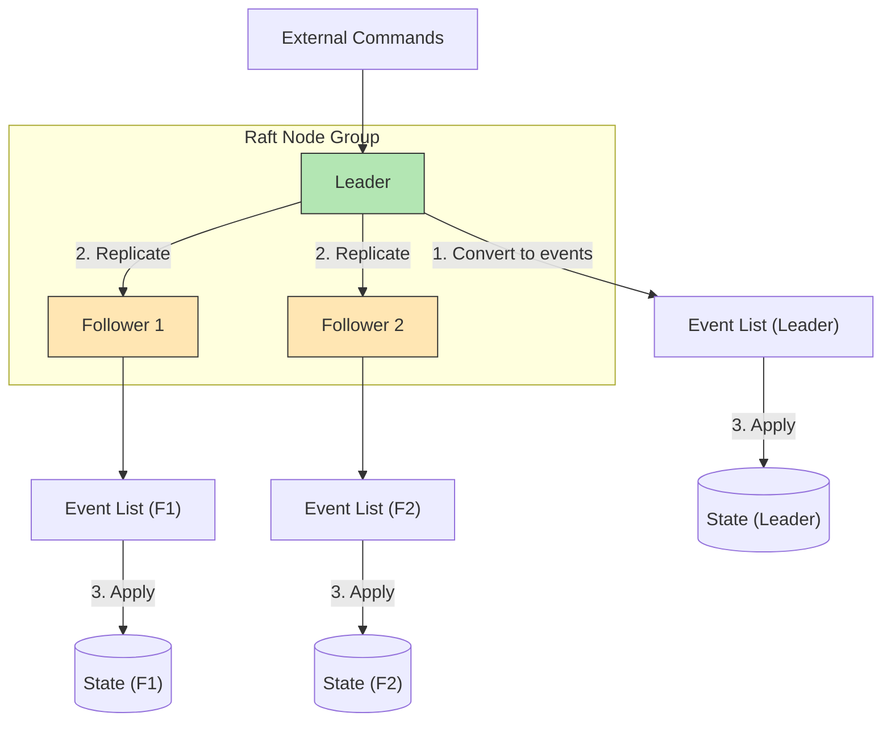

## Summary

The Raft consensus algorithm replicates the immutable event list across multiple nodes to eliminate single points of failure in the file-based event sourcing architecture. A **leader** node receives commands, converts them to events, and replicates events to **followers**. The system tolerates failures of up to (n-1)/2 nodes: 3 nodes tolerate 1 failure; 5 nodes tolerate 2. If the leader crashes, Raft automatically elects a new leader from healthy nodes. Only event data requires high-reliability replication -- state and snapshots can always be regenerated by replaying the event list.

## How It Works

### Node Roles

| Role | Responsibility |
|---|---|
| **Leader** | Receives commands, generates events, replicates to followers |
| **Follower** | Receives replicated events, applies them to local state |
| **Candidate** | Temporary role during leader election |

### Failure Tolerance

| Nodes | Tolerated Failures | Majority Required |
|---|---|---|
| 3 | 1 | 2 |
| 5 | 2 | 3 |
| 7 | 3 | 4 |

### What Needs Replication?

| Data Type | Needs Replication? | Why |
|---|---|---|
| Event list | Yes (critical) | Immutable facts; cannot be regenerated |
| Command list | No | Events may differ from commands (non-deterministic generation) |
| State | No | Regenerated by replaying events |
| Snapshots | No | Regenerated by replaying events to a checkpoint |

### Failure Handling

- **Leader crash:** Raft elects a new leader. If the crash happened before command-to-event conversion, the client retries the command to the new leader.
- **Follower crash:** Raft retries replication indefinitely until the node recovers or is replaced. Remaining nodes continue serving.

## When to Use

- When file-based event sourcing creates stateful nodes that are single points of failure
- When you need strong consistency for the event log across replicas
- When automatic failover is required without manual intervention
- When the ordering of events must be preserved identically across all nodes

## Trade-offs

| Benefit | Cost |
|---|---|
| Automatic leader election and failover | Write latency increases (must replicate before acknowledging) |
| Strong consistency for event log | Requires odd number of nodes (3, 5, 7) |
| Tolerates minority failures | Cannot make progress if majority is down |
| Same event list everywhere (by consensus) | Network partitions can cause temporary unavailability |
| Only events need replication (not state) | Additional network bandwidth for replication |

## Real-World Examples

- **etcd** -- Raft-based distributed key-value store used by Kubernetes
- **CockroachDB** -- Uses Raft for distributed consensus across ranges
- **TiKV** -- Distributed key-value store using Raft (used by TiDB)
- **Consul** -- Raft-based service mesh and configuration store
- **RabbitMQ Quorum Queues** -- Raft-based replicated queues for reliability

## Common Pitfalls

- Using an even number of nodes -- no clear majority in a split-brain scenario
- Replicating state instead of events -- unnecessarily large replication payloads; events are sufficient
- Not handling the case where a command was received but not yet converted to an event before leader crash -- client must detect timeout and retry
- Placing all Raft nodes in the same availability zone -- correlated failures defeat the purpose
- Setting the election timeout too low -- causes unnecessary leader elections under temporary load

## See Also

- [[event-sourcing]] -- The architecture that Raft replicates
- [[high-performance-event-sourcing]] -- File-based storage that Raft makes reliable
- [[event-sourcing]] -- Multiple Raft groups in the partitioned design
