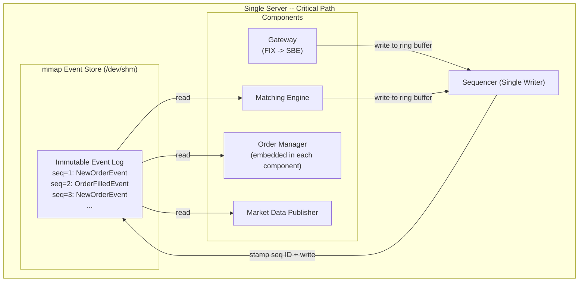
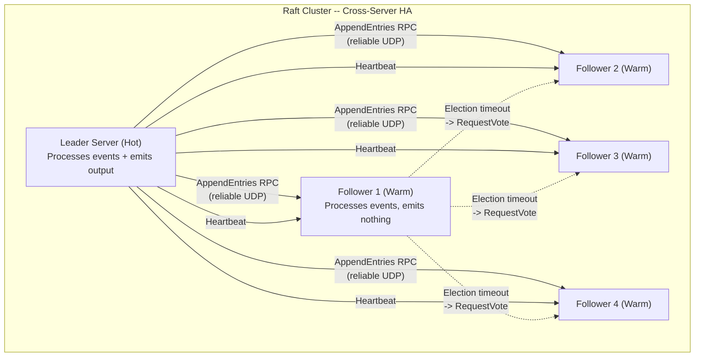

## Summary

Instead of storing mutable state in a database, the exchange records every state change as an immutable event (NewOrderEvent, OrderFilledEvent) in an **mmap-backed event store**. Components communicate through this shared store rather than over the network, achieving **sub-microsecond IPC** when backed by `/dev/shm` (memory-only, no disk access). Each component maintains its own copy of order manager state by replaying events, guaranteeing identical state across all replicas. For high availability, **hot-warm failover** uses **Raft consensus** to replicate the event store across servers. A warm instance processes all events but emits none, enabling instant takeover when the leader fails.

## How It Works

### Key Design Elements

| Element | Role |
|---|---|
| **mmap over /dev/shm** | Memory-backed file system; IPC with zero disk I/O |
| **Immutable event log** | Golden source of truth; append-only, never modified |
| **Sequencer** | Single writer that stamps and writes events to the store |
| **Embedded order manager** | Each component maintains its own state from events |
| **Hot-warm failover** | Warm instance replays events but does not emit; takes over instantly |
| **Raft consensus** | Replicates event store across 5 servers; automatic leader election |

### Recovery Characteristics

- **Functional determinism**: replay same events in same order -> identical state
- **Time compression**: replay ignores wall-clock gaps between events, recovering in seconds
- **RTO**: seconds (automatic failover, no human intervention)
- **RPO**: near zero (Raft guarantees consensus before acknowledgment)

## When to Use

- Ultra-low-latency systems where network and disk I/O are unacceptable on the critical path
- Systems requiring deterministic replay for recovery, auditing, or regulatory compliance
- When hot-warm failover with near-instant switchover is needed
- Financial systems where every state change must be auditable and reproducible

## Trade-offs

| Aspect | Benefit | Cost |
|---|---|---|
| mmap event store | Sub-microsecond IPC, no disk on critical path | OS-specific (POSIX), complex to implement correctly |
| Kafka event store | Battle-tested, rich ecosystem, easy to use | Higher latency (ms), less predictable tail latency |
| Single-server design | Eliminates all network hops | Vertical scaling limit, single server = SPOF without Raft |
| Raft replication | Cross-datacenter fault tolerance, automatic failover | Replication adds latency; minimum 3 nodes for quorum |
| Embedded order manager | Each component has consistent state, no shared DB | State duplicated N times; replay time grows with log size |
| External order manager | Single source of truth, no duplication | Network hop on critical path; single point of failure |
| Event sourcing | Full audit trail, deterministic replay, easy recovery | Event log grows forever; need compaction/snapshots |
| Traditional DB state | Simple to query current state | No history; hard to debug or audit |

## Real-World Examples

- **LMAX Exchange**: pioneered the single-writer, event-sourced exchange architecture; open-sourced Disruptor
- **NYSE Pillar**: uses event-sourced architecture for deterministic matching and recovery
- **CME Globex**: replicates matching state across data centers for fault tolerance
- **Aeron** (Real Logic): open-source reliable messaging library used for event replication in exchanges
- **Coinbase**: uses cloud-based event sourcing for crypto exchange operations (AWS)

## Common Pitfalls

- Allowing multiple writers to the event store -- causes lock contention and breaks total ordering
- Not compacting or snapshotting the event log -- replay time grows linearly with history
- Mixing mutable state updates with event sourcing -- breaks determinism guarantee
- Assuming Raft replication is free -- each AppendEntries RPC adds latency proportional to network distance
- Not testing replay determinism -- code changes can silently break event compatibility
- Using wall-clock time in event processing -- clock differences between servers break determinism

## See Also

- [[matching-engine]] -- the component whose state is managed via event sourcing
- [[sequencer]] -- the single writer that stamps and persists events
- [[risk-checks-order-management]] -- order manager state is maintained by replaying events
