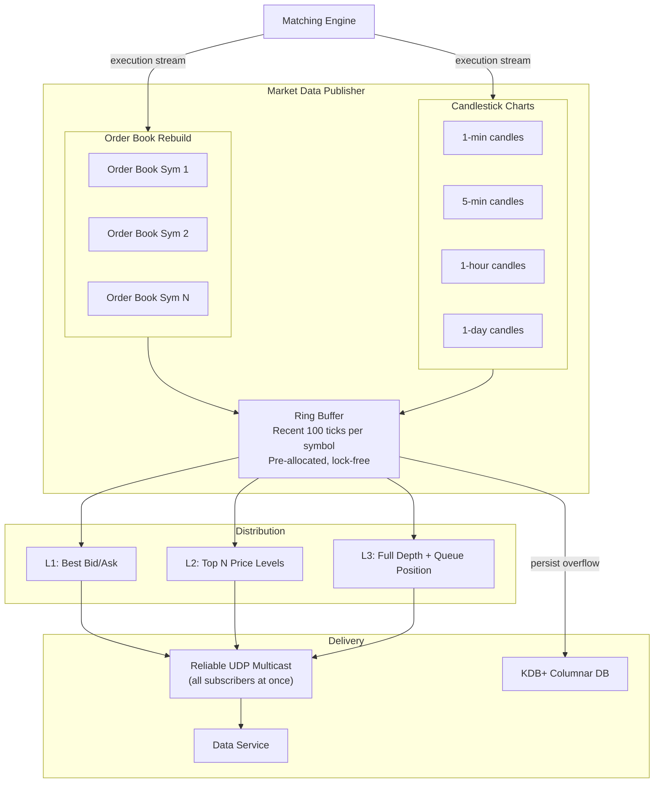

## Summary

The **market data publisher** (MDP) receives the execution stream from the matching engine and reconstructs **order books** (L1/L2/L3 market data) and **candlestick charts** (OHLCV per time interval). It uses **pre-allocated ring buffers** to hold recent ticks, avoiding object allocation and garbage collection pauses. Data is distributed to subscribers via **reliable UDP multicast**, ensuring all clients receive updates simultaneously for fairness. Beyond the ring buffer window, candlestick data is persisted to an in-memory columnar database (e.g., KDB+) for real-time analytics. After market close, data moves to a historical database.

## How It Works

### Market Data Levels

| Level | Content | Typical Audience |
|---|---|---|
| **L1** | Best bid price, best ask price, quantities | Retail investors (free) |
| **L2** | Multiple price levels with aggregated volume | Active traders (paid) |
| **L3** | All price levels with individual order queue positions | Institutional, market makers (premium) |

### Candlestick Chart

Each candlestick captures four prices (Open, High, Low, Close) plus volume for a time interval. Common intervals: 1-min, 5-min, 1-hour, 1-day. When the interval elapses, a new Candlestick object is instantiated and added to a linked list.

### Ring Buffer Optimization

- **Pre-allocated**: fixed-size circular queue, no object creation/deallocation at runtime
- **Lock-free**: single producer (MDP), multiple consumers (data service, persistence)
- **Cache-line padding**: sequence numbers padded to avoid false sharing
- **Bounded memory**: only recent N ticks in memory; older data persisted to disk

## When to Use

- Any exchange or trading platform that publishes real-time market data
- Systems requiring fair, simultaneous data delivery to multiple subscribers
- High-frequency data streaming where GC pauses are unacceptable
- When candlestick or OHLCV aggregation must happen in real-time

## Trade-offs

| Aspect | Benefit | Cost |
|---|---|---|
| Ring buffer (pre-allocated) | No GC pauses, predictable latency | Fixed size limits history in memory |
| Dynamic allocation | Unlimited in-memory history | GC pauses, memory fragmentation |
| UDP multicast | Simultaneous delivery (fairness) | Unreliable; needs retransmission protocol |
| TCP unicast per subscriber | Reliable delivery | First-in-list subscriber gets data first (unfair) |
| KDB+ (columnar in-memory) | Ultra-fast time-series analytics | Expensive license, specialized query language (q) |
| Standard RDBMS | Familiar SQL, cheap | Too slow for tick-level real-time analytics |
| Random subscriber ordering | Mitigates subscriber-list position gaming | Does not guarantee true simultaneity |

## Real-World Examples

- **NYSE**: publishes L1/L2 via consolidated data feeds (CTA/CQS) and proprietary feeds
- **Nasdaq TotalView**: L3 data showing every order in the book via ITCH protocol
- **CME Market Data Platform (MDP 3.0)**: multicast-based delivery with sequence numbers
- **Bloomberg Terminal**: aggregates market data from multiple exchanges for display
- **Refinitiv (formerly Reuters)**: distributes real-time market data globally

## Common Pitfalls

- Not limiting ring buffer size -- memory grows unbounded during volatile sessions
- Serving subscribers in connection order -- first connector always gets data first, creating unfairness
- Ignoring UDP packet loss -- without retransmission, subscribers miss updates and have stale views
- Building candlesticks from L1 snapshots instead of the execution stream -- misses intra-tick detail
- Not separating retail (L1/L2) from institutional (L3) feeds -- one slow subscriber backs up all

## See Also

- [[matching-engine]] -- produces the execution stream consumed by the MDP
- [[order-book]] -- the data structure rebuilt by the MDP from execution data
- [[sequencer]] -- sequence numbers in the execution stream enable gap detection in market data
