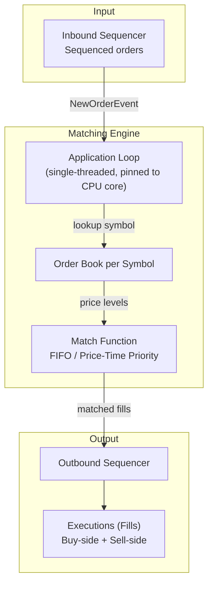

## Summary

The **matching engine** is the core of a stock exchange. It maintains an order book for each traded symbol and matches incoming buy and sell limit orders using a FIFO (price-time priority) algorithm. A successful match produces two executions (fills) -- one for the buy side and one for the sell side. The engine must be **deterministic**: given the same sequence of input orders, it always produces the same sequence of executions. This determinism is the foundation of high availability, enabling replay-based recovery and hot-warm failover. In modern low-latency exchanges, the matching engine runs in a **single-threaded application loop** pinned to a dedicated CPU core, eliminating context switches and lock contention to achieve sub-millisecond matching.

## How It Works

1. The **inbound sequencer** delivers orders stamped with sequential IDs
2. The application loop dispatches each order to the correct symbol's order book
3. For a BUY order, the match function walks the sell book (ascending price); for SELL, the buy book (descending price)
4. At each price level, orders are matched **FIFO** -- first in, first out
5. Each match generates two execution records (fills), stamped by the outbound sequencer
6. Unmatched remainder rests in the order book at the specified limit price

**FIFO matching pseudocode:**
- If `incoming.side == BUY`: iterate sell book from best ask upward
- At each price level, consume orders head-to-tail until incoming is filled or price exceeds limit
- Generate a fill for each partial or full match

**Variants:** FIFO with LMM (Lead Market Maker) allocates a negotiated portion to the market maker ahead of the FIFO queue, incentivizing liquidity provision.

## When to Use

- Any electronic exchange (equities, futures, options, crypto)
- Dark pools (anonymous matching with different price discovery rules)
- Auction systems requiring deterministic, fair order processing
- When regulatory compliance demands reproducible matching results

## Trade-offs

| Aspect | Benefit | Cost |
|---|---|---|
| Single-threaded app loop | No locks, no context switches, predictable 99p latency | Throughput limited to one core |
| CPU pinning | Eliminates scheduler jitter | Wastes a core if idle; complex deployment |
| FIFO algorithm | Simple, fair, transparent | No priority for liquidity providers |
| FIFO + LMM | Incentivizes market makers | More complex, less transparent |
| Deterministic design | Replay-based recovery, audit trail | Every input must be sequenced; adds sequencer dependency |
| In-process matching | Fastest possible (no IPC) | Harder to scale horizontally |

## Real-World Examples

- **NYSE** (Pillar): processes billions of matches per day with deterministic matching
- **Nasdaq** (INET): FIFO price-time priority matching engine
- **CME Globex**: supports multiple matching algorithms (FIFO, pro-rata, LMM allocation)
- **LMAX Exchange**: open-sourced the Disruptor ring buffer pattern used in its matching engine
- **IEX**: adds a 350-microsecond speed bump before matching to ensure fairness

## Common Pitfalls

- Using multi-threaded matching without careful lock management -- destroys determinism and adds unpredictable latency spikes
- Not separating the matching engine from logging/reporting on the critical path -- disk I/O adds milliseconds
- Assuming Kafka-level latency is acceptable for the event store connecting to the engine (it is not for modern exchanges)
- Forgetting that Java GC pauses (stop-the-world) cause latency spikes at the 99.99th percentile
- Not testing determinism: replaying the same order sequence must always produce identical fills

## See Also

- [[order-book]] -- the data structure the matching engine operates on
- [[sequencer]] -- provides the sequential IDs that make matching deterministic
- [[event-sourcing-exchange]] -- the paradigm that enables replay-based recovery
- [[risk-checks-order-management]] -- validates orders before they reach the engine
