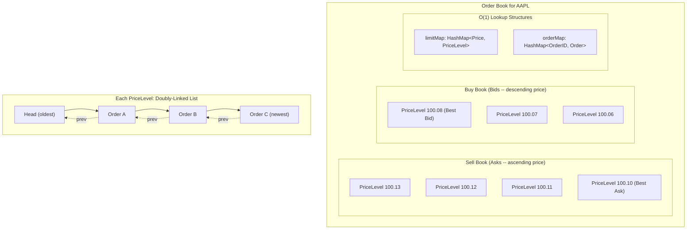

## Summary

The **order book** (or limit order book) is the central data structure in a matching engine. It organizes buy and sell limit orders by price level for a single symbol. Each price level maintains a **doubly-linked list** of orders in arrival order. Two hash maps -- `limitMap` (Price to PriceLevel) and `orderMap` (OrderID to Order) -- enable **O(1) time complexity** for all critical operations: placing an order (append to tail), matching (remove from head), and canceling (find via orderMap, remove via doubly-linked list pointers). The order book also provides best bid/ask for L1 data, multiple price levels for L2, and per-order queue positions for L3 market data.

## How It Works

### O(1) Operations

| Operation | How | Time |
|---|---|---|
| **Place** (new order) | Append to tail of PriceLevel's doubly-linked list | O(1) |
| **Match** (fill order) | Remove from head of PriceLevel's doubly-linked list | O(1) |
| **Cancel** (remove order) | Find via `orderMap[orderID]`; remove node using prev/next pointers | O(1) |
| **Price lookup** | `limitMap[price]` returns the PriceLevel | O(1) |
| **Best bid/ask** | Maintained as direct pointers updated on each operation | O(1) |

**Why doubly-linked list?** A singly-linked list would require O(n) traversal to find the previous node for deletion during cancel. The doubly-linked list stores a `prev` pointer on each node, enabling direct removal.

## When to Use

- Any matching engine that processes limit orders
- Market data systems that reconstruct L1/L2/L3 views from execution streams
- Simulation and backtesting engines for trading strategies
- When order operations must be O(1) to meet microsecond-level latency budgets

## Trade-offs

| Aspect | Benefit | Cost |
|---|---|---|
| Doubly-linked list per level | O(1) cancel via prev pointer | Extra memory for prev pointers |
| Singly-linked list per level | Less memory | O(n) cancel -- unacceptable for production |
| HashMap for orderMap | O(1) cancel lookup | Memory overhead per order |
| TreeMap for price levels | Sorted iteration built-in | O(log n) insert/lookup vs O(1) |
| Pre-allocated memory pool | No GC pauses, predictable latency | Complex memory management |
| Dynamic allocation | Simpler code | GC pauses at 99.99p, memory fragmentation |

## Real-World Examples

- **NYSE Pillar**: maintains per-symbol order books with price-time priority
- **Nasdaq ITCH**: publishes L3 data showing individual order queue positions
- **CME Globex**: order books for futures contracts with pro-rata and FIFO matching
- **LMAX Disruptor**: uses ring buffers to feed orders into the order book at ultra-low latency
- **Cryptocurrency exchanges** (Binance, Coinbase): same doubly-linked list + hashmap pattern

## Common Pitfalls

- Using a plain `List<Order>` instead of a doubly-linked list -- cancel becomes O(n)
- Not maintaining the `orderMap` -- makes cancel operations require a full book scan
- Forgetting to update best bid/ask pointers when a price level is emptied
- Unbounded growth of price levels during volatile markets -- need cleanup of empty levels
- Not pre-allocating Order objects -- dynamic allocation causes GC pressure in Java/Go

## See Also

- [[matching-engine]] -- uses the order book to match buy and sell orders
- [[market-data-publisher]] -- rebuilds order book views (L1/L2/L3) from execution streams
- [[sequencer]] -- ensures orders arrive at the order book in deterministic sequence
