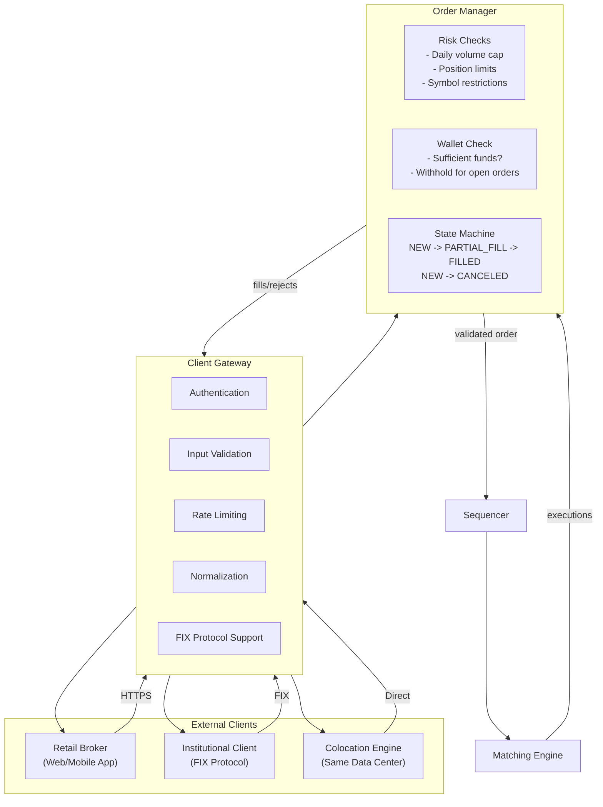
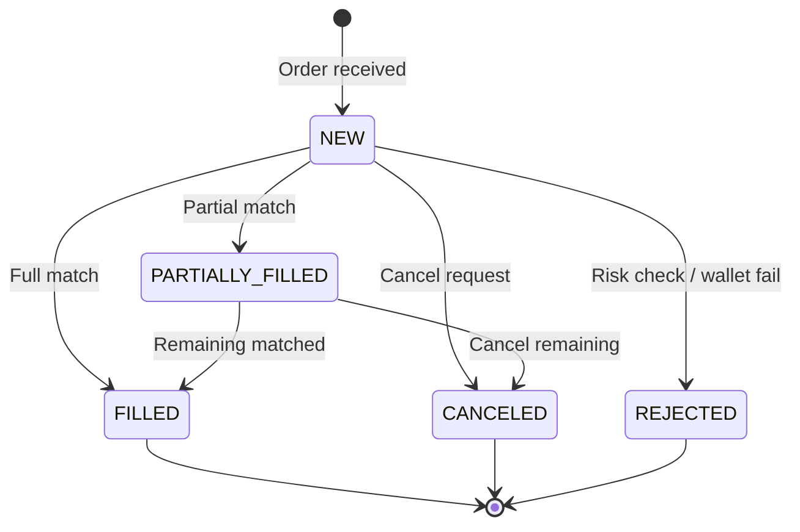

## Summary

The **order manager** sits between the client gateway and the matching engine on the critical trading path. It validates orders through **risk checks** (e.g., daily volume cap of 1M shares per symbol per user), verifies **wallet funds** are sufficient and withholds them to prevent overspending, and manages **order state transitions** (new, partially filled, filled, canceled). The **client gateway** is the exchange's front door -- it handles authentication, rate limiting, input validation, normalization, and FIX protocol support. For institutional clients requiring ultra-low latency, **colocation** places broker servers in the same data center as the exchange, reducing latency to the speed of light across a cable.

## How It Works

### Order State Machine

### Risk Check Examples

| Check | Rule | Purpose |
|---|---|---|
| Daily volume cap | Max 1M shares per symbol per user per day | Prevent market manipulation |
| Order size limit | Max quantity per single order | Prevent fat-finger errors |
| Price band check | Order price within N% of last trade | Prevent erroneous fills |
| Wallet verification | Funds >= order value; withhold funds for open orders | Prevent overspending |

### Client Gateway Types

| Client Type | Connection | Latency Priority |
|---|---|---|
| Retail (web/mobile) | HTTPS via load balancer | Seconds acceptable |
| Institutional (API) | FIX or proprietary protocol | Milliseconds |
| Colocation | Direct connection in same DC | Microseconds |

## When to Use

- Any regulated exchange that must enforce trading rules and prevent market abuse
- Systems where pre-trade risk checks are legally required
- When wallet/account balance must be managed atomically with order placement
- Multi-tier client access with different latency requirements

## Trade-offs

| Aspect | Benefit | Cost |
|---|---|---|
| Risk checks on critical path | Prevents bad orders from reaching matching engine | Adds latency to every order |
| Risk checks off critical path | Lower latency for all orders | Bad orders could match before being caught |
| Embedded order manager | Each component has consistent state (event sourcing) | State duplicated across components |
| Centralized order manager | Single source of truth | Network hop; single point of failure |
| Synchronous wallet check | Guarantees funds before matching | Adds latency; wallet becomes bottleneck |
| Async wallet check (post-trade) | Faster order processing | Risk of overspending; settlement complexity |
| Colocation | Lowest possible latency for institutional clients | Expensive; raises fairness concerns |
| No colocation | Level playing field | Loses institutional client revenue |

## Real-World Examples

- **NYSE**: pre-trade risk checks include price collars, order size limits, and market-wide circuit breakers
- **CME**: risk management via CME CORE (real-time clearing and margining)
- **Robinhood**: retail gateway with simplified order types and built-in wallet management
- **IEX**: intentional 350us speed bump on all orders to reduce colocation advantage
- **Equinix NY5/NY9**: major colocation facilities used by high-frequency trading firms

## Common Pitfalls

- Making the client gateway too heavy -- complex business logic should live in the order manager or matching engine, not the gateway
- Not withholding funds for open (unfilled) orders -- leads to overspending when multiple orders fill simultaneously
- Hardcoding risk rules -- should be configurable by a risk manager without code changes
- Not handling the tens of thousands of state transition edge cases in the order manager
- Treating colocation as unfair -- it is a legitimate paid service, not a fairness violation
- Blocking on wallet checks in a single-threaded loop -- wallet operations should be pre-computed or cached

## See Also

- [[matching-engine]] -- receives validated orders after risk checks pass
- [[sequencer]] -- stamps validated orders before they enter the matching engine
- [[event-sourcing-exchange]] -- order manager state is reconstructed by replaying events
