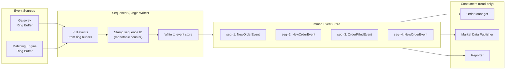

## Summary

The **sequencer** is the component that makes the matching engine deterministic. It stamps every incoming order with a sequential ID before processing and every outgoing execution (fill) with a sequential ID after matching. Sequential numbering means any gap immediately reveals a missing message, enabling exactly-once guarantees. In the high-level design, there are separate inbound and outbound sequencer instances. In the event sourcing design, the sequencer is a **single writer** that pulls events from per-component ring buffers, stamps a sequence ID, and writes to the mmap event store. Only one sequencer writes per event store to avoid lock contention.

## How It Works

### Why Sequential IDs?

| Purpose | Mechanism |
|---|---|
| **Timeliness & fairness** | Orders processed in arrival sequence |
| **Fast recovery / replay** | Replay from any sequence number forward |
| **Exactly-once guarantee** | Gaps in sequence reveal lost messages; duplicates detected by seen IDs |
| **Deterministic matching** | Same input sequence always produces same output |

### Inbound vs Outbound Sequencer

- **Inbound sequencer**: stamps orders before they reach the matching engine
- **Outbound sequencer**: stamps executions (fills) after the matching engine produces them
- In the event sourcing design, both are consolidated into a single sequencer per event store

## When to Use

- Any system requiring deterministic, replayable event processing
- Financial systems where order fairness is a regulatory requirement
- Distributed systems needing gap detection without complex protocols
- Event-sourced architectures where a total ordering of events is needed

## Trade-offs

| Aspect | Benefit | Cost |
|---|---|---|
| Single sequencer (single writer) | No lock contention, simple, fast | Single point of failure; throughput limited to one thread |
| Multiple sequencers | Higher throughput | Lock contention wastes time; ordering conflicts |
| Sequence in event store | Messages and sequence in one place | Tight coupling to storage |
| Separate sequence service | Decoupled from storage | Extra network hop on critical path |
| Sequential numbering | Gap detection trivial | Must never skip or reuse a number |
| UUIDs / timestamps | No coordination needed | Cannot detect gaps; ordering ambiguous |

## Real-World Examples

- **NYSE Pillar**: sequence numbers on all market data messages for gap detection
- **CME Globex**: MDP 3.0 protocol uses sequence numbers for each market data channel
- **Kafka**: partition offsets serve as sequence numbers within each partition
- **LMAX Exchange**: Disruptor ring buffer with a single-threaded sequencer
- **Event Store (database)**: global stream position serves as a sequence number

## Common Pitfalls

- Running multiple sequencers writing to the same event store -- causes lock contention and ordering conflicts
- Using timestamps instead of sequence numbers -- clock skew makes ordering non-deterministic
- Not persisting the sequence counter -- on crash, a restarted sequencer could reuse numbers
- Ignoring sequence gaps in consumers -- missed events corrupt state
- Making the sequencer do too much work (validation, transformation) -- it should only stamp and write

## See Also

- [[matching-engine]] -- consumes sequenced orders and produces sequenced fills
- [[event-sourcing-exchange]] -- the sequencer writes to the mmap event store
- [[order-book]] -- receives orders in the sequence determined by the sequencer
